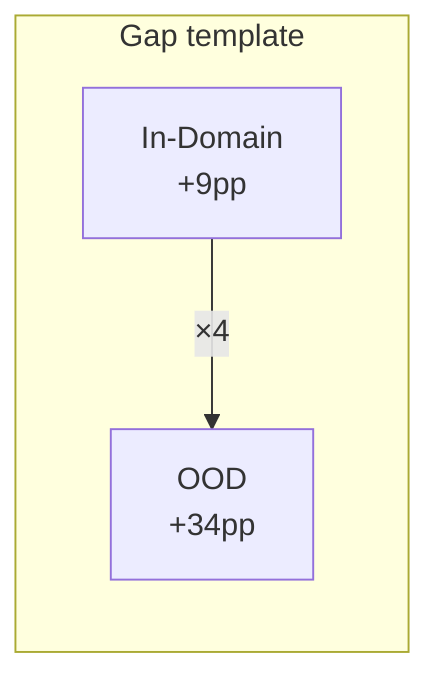

# Analyse des résultats — Sanity Check EMOTYC

## Partie 1 : Corpus OOD Cyberharcèlement (781 samples × 4 domaines)

| Rang | Condition | Description | Emo↔E | B/C | Modes | Total | %Clean |
|------|-----------|-------------|------:|----:|------:|------:|-------:|
| 1 | `ctx0_thr0_tpl1` | bca, 0.5 | 22 | 36 | 128 | **186** | **81.7%** |
| 2 | ★`ctx0_thr1_tpl1` | bca, opt | 30 | 66 | 146 | 242 | 79.1% |
| 3 | `ctx1_thr0_tpl1` | bca, 0.5, +ctx | 49 | 54 | 191 | 294 | 72.6% |
| 4 | `ctx1_thr1_tpl1` | bca, opt, +ctx | 53 | 95 | 210 | 358 | 69.8% |
| 5–6 | `*_thr0_tpl0` | raw, 0.5 | 261 | 195 | 223 | 679 | 48.0% |
| 7–8 | `*_thr1_tpl0` | raw, opt | 342 | 272 | 213 | 827 | 45.1% |

---

## Partie 2 : Corpus In-Domain EmoTextToKids (27 911 samples)

| Rang | Condition | Description | Emo↔E | B/C | Modes | Total | %Clean |
|------|-----------|-------------|------:|----:|------:|------:|-------:|
| **1** | `ctx1_thr0_tpl1` | **bca, 0.5, +ctx** | 99 | 168 | 1999 | **2266** | **92.8%** |
| 2 | `ctx0_thr0_tpl1` | bca, 0.5 | 128 | 214 | 2057 | 2399 | 92.5% |
| 3 | `ctx1_thr1_tpl1` | bca, opt, +ctx | 264 | 434 | 2451 | 3149 | 91.7% |
| 4 | ★`ctx0_thr1_tpl1` | bca, opt | 356 | 549 | 2621 | 3526 | 91.3% |
| 5–6 | `*_thr0_tpl0` | raw, 0.5 | 3289 | 2068 | 1920 | 7277 | 83.9% |
| 7–8 | `*_thr1_tpl0` | raw, opt | 4270 | 3035 | 2038 | 9343 | 82.6% |

---

## Partie 3 : Analyse comparative In-Domain vs OOD

### 3.1. Vue d'ensemble — Le gap de distribution

```
                    In-Domain (27911)     OOD (781)       Δ
                    ────────────────      ─────────       ──
Meilleur %Clean     92.8%                81.7%           −11.1pp
Pire %Clean         82.6%                45.1%           −37.5pp
Condition canon.★   91.3%                79.1%           −12.2pp
```

> [!IMPORTANT]
> **Le modèle perd ~12pp de cohérence structurelle en passant de l'in-domain au OOD** dans la condition canonique. Mais ce gap monte à **37pp pour le pire cas** (raw + opt thresholds), révélant que le template BCA agit comme un stabilisateur structurel bien plus critique hors-domaine.

---

### 3.2. Effet du template : stabilisateur en OOD, bonus en in-domain

```
                        sans template    avec template    Gap
                        ─────────────    ─────────────    ───
In-Domain (0.5, no ctx)    83.9%           92.5%          +8.6pp
OOD       (0.5, no ctx)    48.0%           81.7%         +33.7pp
```

Le template BCA ameliore la cohérence dans les deux cas, mais l'effet est **4× plus fort en OOD** (34pp vs 9pp). Explication : en in-domain, le modèle "reconnaît" ses données même sans le wrapper template. En OOD, le texte brut de cyberharcèlement est si éloigné de la distribution d'entraînement que sans le cadrage du template, les 19 têtes de classification divergent fortement.



---

### 3.3. Effet du contexte : inversé selon le domaine

C'est le résultat le plus frappant de cette comparaison :

```
                        sans contexte    avec contexte    Δ
                        ─────────────    ─────────────    ──
In-Domain (bca, 0.5)      92.5%            92.8%         +0.3pp ✓
In-Domain (bca, opt)       91.3%            91.7%         +0.4pp ✓
OOD       (bca, 0.5)      81.7%            72.6%         −9.1pp ✗
OOD       (bca, opt)       79.1%            69.8%         −9.3pp ✗
```

> [!WARNING]
> **Le contexte améliore la cohérence in-domain mais la dégrade en OOD.** L'effet est faible mais positif in-domain (+0.3pp), et fortement négatif en OOD (−9pp). Le contexte conversationnel de cyberharcèlement est si distribué différemment du contexte narratif d'EmoTextToKids qu'il agit comme du **bruit structurel** plutôt que comme un signal informatif.

Cela a une implication pratique directe :
- **In-domain** → le contexte peut être utilisé (gain marginal en cohérence)
- **OOD cyberharcèlement** → le contexte doit être désactivé (cela inclut les frontières de domaine)

---

### 3.4. Effet des seuils optimisés : toujours négatif pour la cohérence

```
                        seuils 0.5     seuils opt      Δ
                        ──────────     ──────────      ──
In-Domain (bca, no ctx)   92.5%          91.3%        −1.2pp
In-Domain (bca, +ctx)     92.8%          91.7%        −1.1pp
OOD       (bca, no ctx)   81.7%          79.1%        −2.6pp
OOD       (bca, +ctx)     72.6%          69.8%        −2.8pp
```

Résultat remarquable : **les seuils optimisés dégradent la cohérence même sur les données d'entraînement**. Cela confirme que ces seuils ont été calibrés pour maximiser le F1 par label indépendamment, sans contrainte de cohérence inter-labels. Les seuils très bas de certaines émotions (Jalousie=0.017, Culpabilité=0.127) sur-activent des émotions spécifiques, créant des incohérences avec les méta-labels Emo, Base, Complexe qui utilisent un seuil 0.5.

> [!TIP]
> Cela renforce la recommandation d'un **post-processing de cohérence** logique après thresholding, qui pourrait réconcilier les deux objectifs (F1 élevé ET cohérence structurelle).

---

### 3.5. Analyse par type de violation — comparaison détaillée

Condition canonique ★ `ctx0_thr1_tpl1` (bca, opt) :

| Type de violation | In-Domain | ID % | OOD | OOD % | Ratio |
|---|---:|---:|---:|---:|---:|
| Emo=1 sans émotion | 332 | 1.19% | 22 | 2.82% | ×2.4 |
| Émotion détectée mais Emo=0 | 24 | 0.09% | 8 | 1.02% | ×12 |
| Base=1 sans émotion de base | 291 | 1.04% | 6 | 0.77% | ×0.7 |
| Émotion de base mais Base=0 | 55 | 0.20% | 37 | 4.74% | ×24 |
| Complexe=1 sans émotion cpx | 201 | 0.72% | 23 | 2.94% | ×4.1 |
| Émotion cpx mais Complexe=0 | 2 | 0.01% | 0 | 0.00% | — |
| Mode sans émotion (M>0, E=0) | 345 | 1.24% | 16 | 2.05% | ×1.7 |
| **Émotion sans mode (E>0, M=0)** | **1094** | **3.92%** | **97** | **12.42%** | **×3.2** |
| M > E | 1182 | 4.23% | 33 | 4.23% | ×1.0 |

Constats clés :

1. **« Émotion sans mode » est un défaut structurel du modèle**, présent à 3.9% même in-domain. En OOD, il triple à 12.4%. C'est le talon d'Achille d'EMOTYC.

2. **« Émotion de base mais Base=0 » explose en OOD** (×24 en taux). Le modèle détecte des émotions de base spécifiques sur du texte de cyberharcèlement mais "oublie" d'activer le flag indicateur `Base`. Cela suggère un désalignement entre la tête de classification `Base` (index 5) et les têtes des émotions de base sur la distribution OOD.

3. **« M > E » est identique in-domain et OOD** (4.23% exactement). C'est la seule violation invariante au domaine — un trait structurel du modèle, pas un effet de distribution shift.

4. **« Emo=1 sans émotion »** est 2.4× pire en OOD : le modèle détecte plus facilement le caractère émotionnel global du cyberharcèlement, mais peine à identifier les émotions spécifiques.

---

### 3.6. Meilleure condition in-domain vs OOD : la "surprise" du contexte

```
Meilleure In-Domain :  ctx1_thr0_tpl1  (bca, 0.5, +contexte)    92.8%
Meilleure OOD :        ctx0_thr0_tpl1  (bca, 0.5, sans contexte) 81.7%
```

Les deux partagent `bca` + `seuils 0.5`, mais divergent sur le contexte. La condition optimale change selon le domaine. Un pipeline de production devrait donc adapter le flag `--use-context` au type de données traitées.

---

### 3.7. Le « plancher de cohérence » d'EMOTYC

Même dans les conditions idéales (in-domain, template BCA, contexte), **~7.2% des prédictions restent structurellement incohérentes**. Ce plancher est dominé par :

| Violation | N | % |
|-----------|--:|--:|
| Émotion sans mode (E>0, M=0) | 1085 | 3.89% |
| M > E | 846 | 3.03% |
| **Sous-total "modes"** | **1931** | **~6.9%** |

> [!IMPORTANT]
> **~93% est le plafond de cohérence structurelle** d'EMOTYC dans ses conditions optimales. Les 7% résiduels sont presque entièrement des incohérences modes/émotions. De plus, les gold labels d'EmoTextToKids eux-mêmes contiennent probablement des violations M>E (comme observé sur les gold OOD à ~5-10%), donc une partie de ce résiduel est apprise des données d'entraînement.

---

## Recommandations actualisées

1. **Template BCA obligatoire** — Indispensable, surtout en OOD (34pp de gap vs 9pp in-domain).

2. **Contexte : conditionnel au domaine** — Activer en in-domain (+0.3pp), désactiver en OOD (−9pp).

3. **Post-processing de cohérence** — Cascade de règles logiques après thresholding :
   - `∀ émotion active ⇒ forcer Emo=1`
   - `∀ émotion de base active ⇒ forcer Base=1` ; `∀ émotion complexe active ⇒ forcer Complexe=1`
   - `Si E>0 et M=0 ⇒ forcer le mode avec la plus haute proba à 1`
   - Cela éliminera la majorité des violations Emo↔E et Base/Complexe.

4. **Calibration des seuils modes** — Les modes utilisent un seuil fixe de 0.5 non optimisé. Une calibration dédiée réduirait « Émotion sans mode » (3.9% in-domain, 12.4% OOD).

5. **Reconsidérer la règle M ≤ E** — Elle est violée à 4.23% (identique in-domain et OOD), et aussi dans les gold labels. Soit le schéma d'annotation le permet implicitement (un mode associé à plusieurs émotions), soit c'est un bruit systématique appris.
