# EMOTYC Error Analysis — Comprehensive Report

> Generated: 2026-04-20 20:36
> Configuration: `context=no, thresholds=0.5`

**Dataset**: 781 samples across 4 domains

| Domain | N | % |
|--------|--:|--:|
| Homophobie | 103 | 13.2% |
| Obésité | 373 | 47.8% |
| Racisme | 201 | 25.7% |
| Religion | 104 | 13.3% |

**Labels evaluated**: 12 (Colère, Dégoût, Joie, Peur, Surprise, Tristesse...)


## 1. Global Error Metrics

| Metric | Value |
|--------|------:|
| Hamming Error (mean) | 0.0630 |
| Hamming Error (median) | 0.0833 |
| Jaccard Error (mean) | 0.5077 |
| Weighted Hamming (mean) | 0.0158 |
| Exact Match rate | 0.4661 |


### Per-domain breakdown

| Domain | Mean | Median | Exact Match |
|--------|-----:|-------:|------------:|
| Homophobie | 0.0817 | 0.0833 | 0.3010 |
| Obésité | 0.0583 | 0.0833 | 0.4933 |
| Racisme | 0.0568 | 0.0000 | 0.5323 |
| Religion | 0.0729 | 0.0833 | 0.4038 |


## 2. Per-Label Error Decomposition

| Label | Prevalence | FP rate | FN rate | Accuracy | n_FP | n_FN |
|-------|----------:|---------:|--------:|---------:|-----:|-----:|
| Colère | 0.371 | 0.0627 | 0.2830 | 0.6543 | 49 | 221 |
| Dégoût | 0.102 | 0.0000 | 0.1024 | 0.8976 | 0 | 80 |
| Joie | 0.038 | 0.0102 | 0.0256 | 0.9641 | 8 | 20 |
| Peur | 0.005 | 0.0064 | 0.0026 | 0.9910 | 5 | 2 |
| Surprise | 0.006 | 0.0038 | 0.0038 | 0.9923 | 3 | 3 |
| Tristesse | 0.018 | 0.0230 | 0.0154 | 0.9616 | 18 | 12 |
| Admiration | 0.000 | 0.0000 | 0.0000 | 1.0000 | 0 | 0 |
| Culpabilité | 0.004 | 0.0000 | 0.0038 | 0.9962 | 0 | 3 |
| Embarras | 0.003 | 0.0243 | 0.0000 | 0.9757 | 19 | 0 |
| Fierté | 0.004 | 0.0026 | 0.0000 | 0.9974 | 2 | 0 |
| Jalousie | 0.008 | 0.0000 | 0.0077 | 0.9923 | 0 | 6 |
| Autre | 0.079 | 0.1088 | 0.0691 | 0.8220 | 85 | 54 |

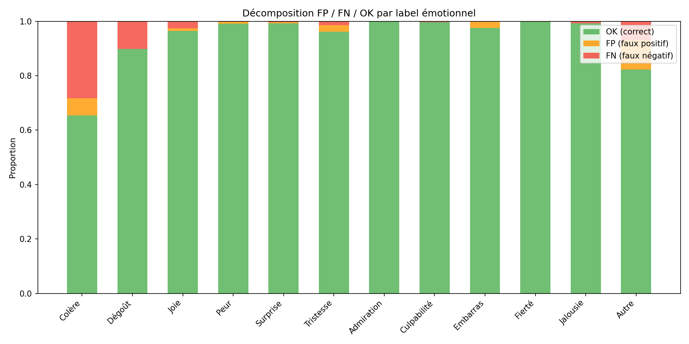


## 3. Annotation Scheme Violations

> [!WARNING]
> These violations indicate structural inconsistencies in the model's predictions.

| Violation Type | Count | Rate |
|----------------|------:|-----:|
| emo_no_emotion | 16 | 2.0% |
| emotion_no_emo | 6 | 0.8% |
| base_no_basic | 5 | 0.6% |
| basic_no_base | 26 | 3.3% |
| complex_no_cpx | 3 | 0.4% |
| cpx_no_complex | 94 | 12.0% |
| mode_no_emotion | 17 | 2.2% |
| emotion_no_mode | 69 | 8.8% |
| **ANY violation** | **135** | **17.3%** |

> [!IMPORTANT]
> The dominant violation is **emotion without mode** (8.8%), confirming the structural weakness identified in previous sanity checks.


## 4. Brier Score Decomposition

The Brier score decomposes as: `BS = reliability − resolution + uncertainty`

- **Reliability** (↓ better): calibration error
- **Resolution** (↑ better): discriminative power
- **Uncertainty**: inherent data entropy (fixed)

| Label | Brier | Reliability | Resolution | Uncertainty | ECE |
|-------|------:|----------:|----------:|----------:|----:|
| Colère | 0.3271 | 0.1040 | 0.0103 | 0.2334 | 0.3173 |
| Dégoût | 0.1009 | 0.0100 | 0.0000 | 0.0919 | 0.1000 |
| Joie | 0.0345 | 0.0053 | 0.0078 | 0.0369 | 0.0332 |
| Peur | 0.0088 | 0.0045 | 0.0008 | 0.0051 | 0.0080 |
| Surprise | 0.0075 | 0.0023 | 0.0013 | 0.0064 | 0.0072 |
| Tristesse | 0.0345 | 0.0174 | 0.0003 | 0.0176 | 0.0371 |
| Admiration | 0.0001 | 0.0000 | 0.0000 | 0.0000 | 0.0009 |
| Culpabilité | 0.0038 | 0.0000 | 0.0000 | 0.0038 | 0.0029 |
| Embarras | 0.0169 | 0.0149 | 0.0006 | 0.0026 | 0.0242 |
| Fierté | 0.0019 | 0.0019 | 0.0038 | 0.0038 | 0.0040 |
| Jalousie | 0.0077 | 0.0001 | 0.0000 | 0.0076 | 0.0076 |
| Autre | 0.1597 | 0.0875 | 0.0009 | 0.0731 | 0.1653 |
| Comportementale | 0.0444 | 0.0080 | 0.0072 | 0.0440 | 0.0417 |
| Désignée | 0.0712 | 0.0180 | 0.0116 | 0.0655 | 0.0697 |
| Montrée | 0.3436 | 0.1146 | 0.0078 | 0.2369 | 0.3345 |
| Suggérée | 0.0692 | 0.0090 | 0.0038 | 0.0644 | 0.0666 |

> [!NOTE]
> Mean ECE for emotions = 0.0590, for modes = 0.1281. Modes are worse calibrated.


## 5. Conditional Error Analysis (Modes ↔ Emotions)


### Which modes degrade emotion detection?

Δ F1 = F1(emotion | mode present) − F1(emotion global). **Negative = degradation** when this mode is present.

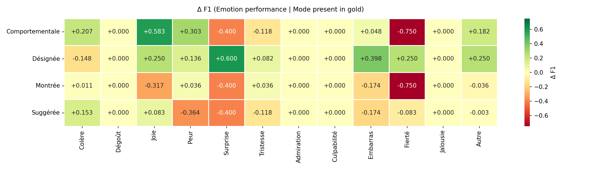

**Top degradations** (mode → emotion):

- `Comportementale` → `Fierté`: Δ F1 = -0.750 (F1=0.000, n=36)
- `Montrée` → `Fierté`: Δ F1 = -0.750 (F1=0.000, n=301)
- `Comportementale` → `Surprise`: Δ F1 = -0.400 (F1=0.000, n=36)
- `Montrée` → `Surprise`: Δ F1 = -0.400 (F1=0.000, n=301)
- `Suggérée` → `Surprise`: Δ F1 = -0.400 (F1=0.000, n=54)
- `Suggérée` → `Peur`: Δ F1 = -0.364 (F1=0.000, n=54)
- `Montrée` → `Joie`: Δ F1 = -0.317 (F1=0.100, n=301)
- `Montrée` → `Embarras`: Δ F1 = -0.174 (F1=0.000, n=301)


### Which emotions degrade mode detection?

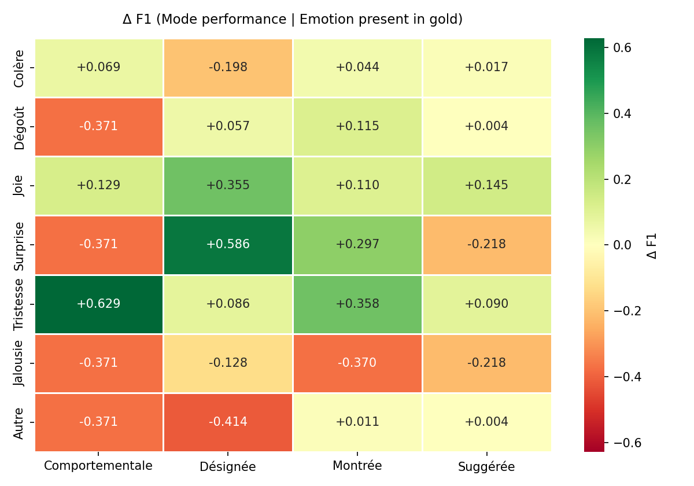


## 6. Interaction & Combination Analysis

**Interaction effect** = observed error − expected error under additivity.

- **Positive (conflict)**: the combination performs *worse* than expected
- **Negative (synergy)**: the combination performs *better* than expected

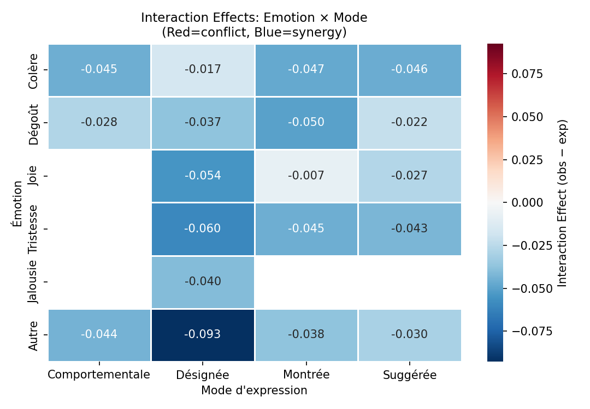


### Top Synergies (better than expected)

| Emotion | Mode | Observed | Expected | Δ | n |
|---------|------|--------:|---------:|--:|--:|
| Autre | Désignée | 0.095 | 0.188 | -0.093 | 7 |
| Tristesse | Désignée | 0.111 | 0.171 | -0.060 | 6 |
| Joie | Désignée | 0.088 | 0.143 | -0.054 | 16 |
| Dégoût | Montrée | 0.153 | 0.204 | -0.050 | 69 |
| Colère | Montrée | 0.108 | 0.155 | -0.047 | 250 |
| Colère | Suggérée | 0.119 | 0.165 | -0.046 | 40 |
| Tristesse | Montrée | 0.133 | 0.178 | -0.045 | 5 |
| Colère | Comportementale | 0.113 | 0.158 | -0.045 | 31 |
| Autre | Comportementale | 0.155 | 0.198 | -0.044 | 7 |
| Tristesse | Suggérée | 0.146 | 0.188 | -0.043 | 8 |

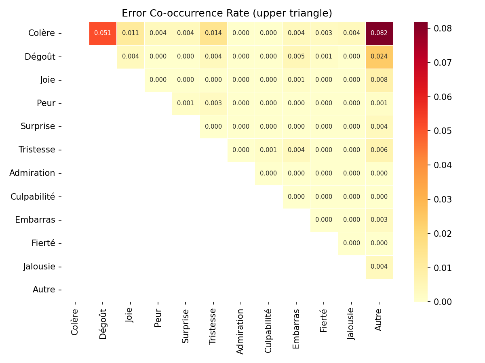


### Combination Profiles

64 unique label configurations found.

**Highest-error profiles:**

| Active Labels | n | Mean Error | Density |
|---------------|--:|-----------:|--------:|
| Tristesse, Autre, Désignée, Suggérée | 1 | 0.250 | 4 |
| Dégoût, Autre, Suggérée | 1 | 0.250 | 3 |
| Colère, Dégoût, Autre, Montrée, Suggérée | 1 | 0.250 | 5 |
| Colère, Dégoût, Comportementale | 1 | 0.250 | 3 |
| Colère, Surprise, Montrée | 1 | 0.250 | 3 |


## 7. Logit & Threshold Analysis


### Logit Separation

Higher separation = better discriminability. Labels with low separation cannot be reliably classified regardless of threshold.

| Label | n+ | n− | Separation | p̄(gold=1) | p̄(gold=0) | Overlap |
|-------|---:|---:|-----------:|----------:|---------:|--------:|
| Colère | 290 | 491 | +2.38 | 0.235 | 0.102 | 0.806 |
| Dégoût | 80 | 701 | +1.72 | 0.008 | 0.002 | 0.928 |
| Joie | 30 | 751 | +6.81 | 0.350 | 0.014 | 0.580 |
| Peur | 4 | 777 | +10.18 | 0.503 | 0.010 | 0.504 |
| Surprise | 5 | 776 | +6.34 | 0.398 | 0.005 | 0.603 |
| Tristesse | 14 | 767 | +4.79 | 0.149 | 0.024 | 0.738 |
| Admiration | 0 | 781 | N/A | N/A | N/A | N/A |
| Culpabilité | 3 | 778 | +1.35 | 0.004 | 0.001 | 0.987 |
| Embarras | 2 | 779 | +13.89 | 0.857 | 0.025 | 0.001 |
| Fierté | 3 | 778 | +14.27 | 0.933 | 0.004 | 0.000 |
| Jalousie | 6 | 775 | +1.59 | 0.000 | 0.000 | 1.000 |
| Autre | 62 | 719 | +1.01 | 0.154 | 0.128 | 0.834 |
| Comportementale | 36 | 745 | +4.74 | 0.233 | 0.017 | 0.563 |
| Désignée | 55 | 726 | +5.84 | 0.312 | 0.034 | 0.565 |
| Montrée | 301 | 480 | +2.03 | 0.227 | 0.107 | 0.820 |
| Suggérée | 54 | 727 | +1.89 | 0.092 | 0.021 | 0.756 |
| Emo | 399 | 382 | +4.24 | 0.477 | 0.184 | 0.666 |
| Base | 364 | 417 | +3.17 | 0.292 | 0.085 | 0.730 |
| Complexe | 14 | 767 | +6.96 | 0.377 | 0.028 | 0.512 |

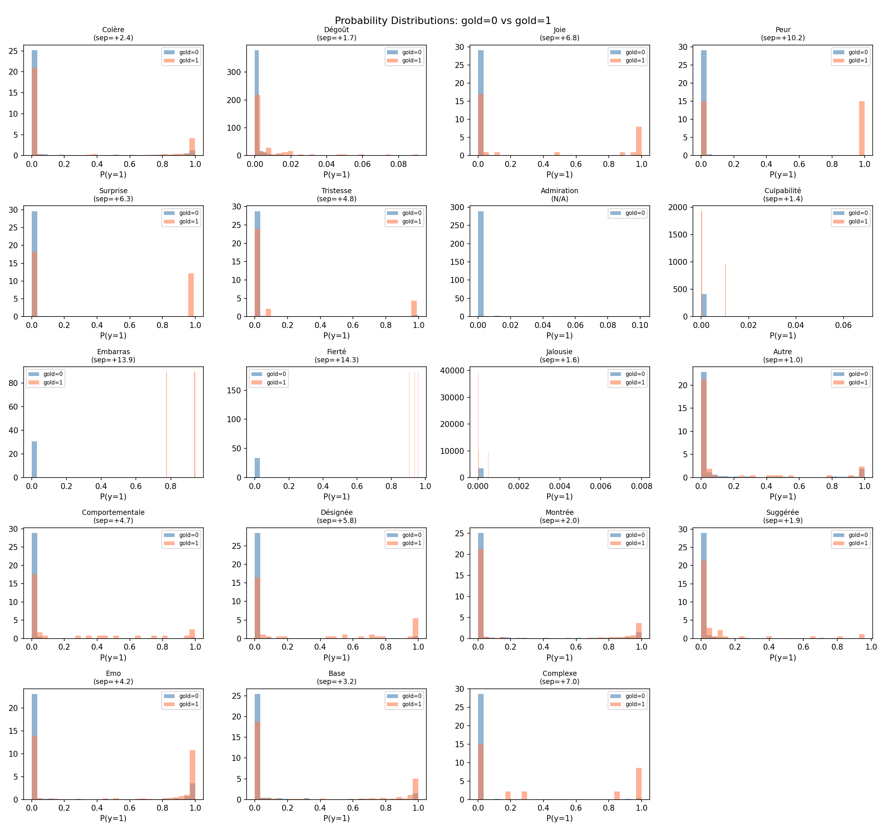


### Threshold Sweep for Expression Modes

> [!TIP]
> Custom mode thresholds can reduce annotation scheme violations while preserving or improving F1.

| Mode | Current θ | Optimal θ | F1@0.5 | F1@opt |
|------|----------:|----------:|------:|-------:|
| Comportementale | 0.500 | 0.180 | 0.291 | 0.381 |
| Désignée | 0.500 | 0.050 | 0.375 | 0.414 |
| Montrée | 0.500 | 0.050 | 0.332 | 0.373 |
| Suggérée | 0.500 | 0.070 | 0.118 | 0.226 |

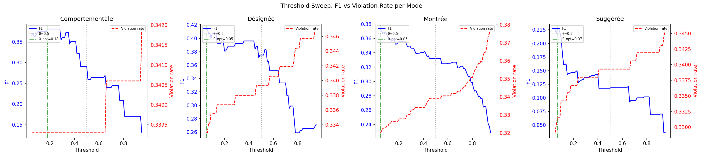


### Calibration

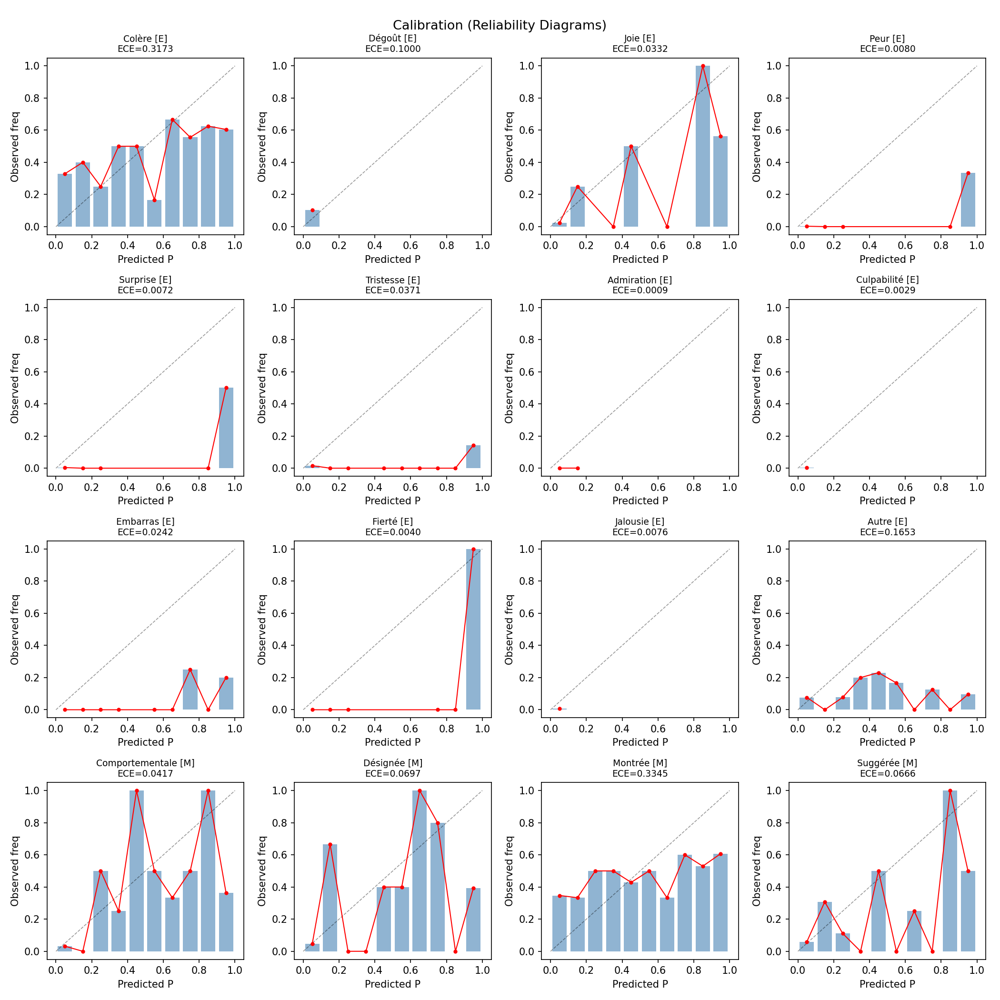


## 8. Density & Length Stratification


### Density-stratified performance

**Spearman correlation** (density vs Hamming): ρ = 0.739, p = 1.49e-135 ***

| Density Bin | Range | n | Mean Error | Exact Match |
|-------------|-------|--:|-----------:|-----------:|
| 0 | [0, 0] | 382 | 0.0161 | 0.814 |
| 1 | [1, 1] | 311 | 0.0914 | 0.170 |
| 2 | [2, 2] | 76 | 0.1579 | 0.000 |
| 3 | [3, 3] | 12 | 0.2153 | 0.000 |

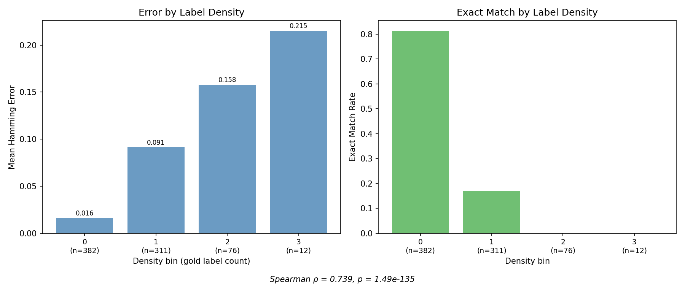


### Domain-controlled density effect

Testing whether the density→error relationship survives within individual domains:

| Domain | n | Mean Density | Mean Error | ρ | p |
|--------|--:|------------:|-----------:|--:|--:|
| Homophobie | 103 | 0.72 | 0.0817 | 0.644 | 2.08e-13 *** |
| Obésité | 373 | 0.62 | 0.0583 | 0.755 | 5.63e-70 *** |
| Racisme | 201 | 0.59 | 0.0568 | 0.816 | 3.69e-49 *** |
| Religion | 104 | 0.72 | 0.0729 | 0.621 | 2.01e-12 *** |


### Length-stratified performance

**Spearman correlation** (word_count vs Hamming): ρ = 0.327, p = 6.31e-21 ***

Kruskal-Wallis: H=80.5008, p=3.31e-18, direction=increasing

| Length Bin | Range | n | Mean Error | Exact Match |
|-----------|-------|--:|-----------:|-----------:|
| short | [0, 4] | 264 | 0.0385 | 0.633 |
| medium | [5, 8] | 277 | 0.0590 | 0.466 |
| long | [9, 32] | 240 | 0.0944 | 0.283 |


### Cross-stratification (Density × Length)

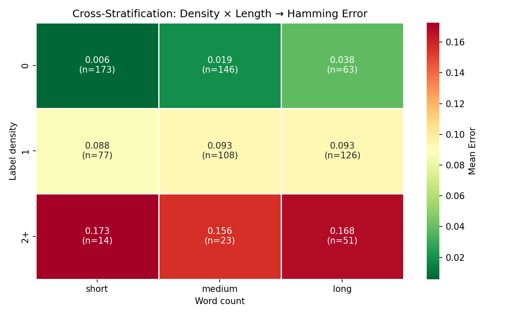

> [!CAUTION]
> **Danger zones** — combinations with highest error rates:
>
> - density=2+, length=short: mean_error=0.1726 (n=14)
> - density=2+, length=long: mean_error=0.1683 (n=51)
> - density=2+, length=medium: mean_error=0.1558 (n=23)


## 9. Feature Importance & Explainability


### Univariate Analysis

Features ranked by statistical significance (effect on Hamming error):

| Feature | Test | p-value | η² | Top Level | Mean Error |
|---------|------|--------:|---:|-----------|-----------:|
| HATE | Kruskal-Wallis | 1.99e-14 *** | 0.079 | OAG | 0.0800 |
| insulte | Mann-Whitney U | 1.40e-13 *** | 98.733 | 1 | 0.0938 |
| SENTIMENT | Kruskal-Wallis | 2.28e-09 *** | 0.049 | POS | 0.0741 |
| mépris / haine | Mann-Whitney U | 1.66e-08 *** | 117.450 | 1 | 0.0799 |
| INTENTION | Kruskal-Wallis | 1.28e-06 *** | 0.043 | GSL | 0.0781 |
| abréviation | Mann-Whitney U | 3.81e-05 *** | 27.686 | 1 | 0.0904 |
| argot | Mann-Whitney U | 6.32e-05 *** | 74.546 | 1 | 0.0817 |
| domain | Kruskal-Wallis | 9.37e-04 *** | 0.017 | Homophobie | 0.0817 |
| elongation | Mann-Whitney U | 3.01e-03 ** | 5.096 | 1 | 0.1127 |
| VERBAL_ABUSE | Kruskal-Wallis | 9.37e-03 ** | 0.017 | DNG | 0.0949 |
| interjection | Mann-Whitney U | 1.43e-02 * | 31.169 | 1 | 0.0803 |
| ROLE | Kruskal-Wallis | 6.54e-02 ns | 0.006 | bully | 0.0781 |


### Random Forest Regressor

- OOB R²: 0.2045

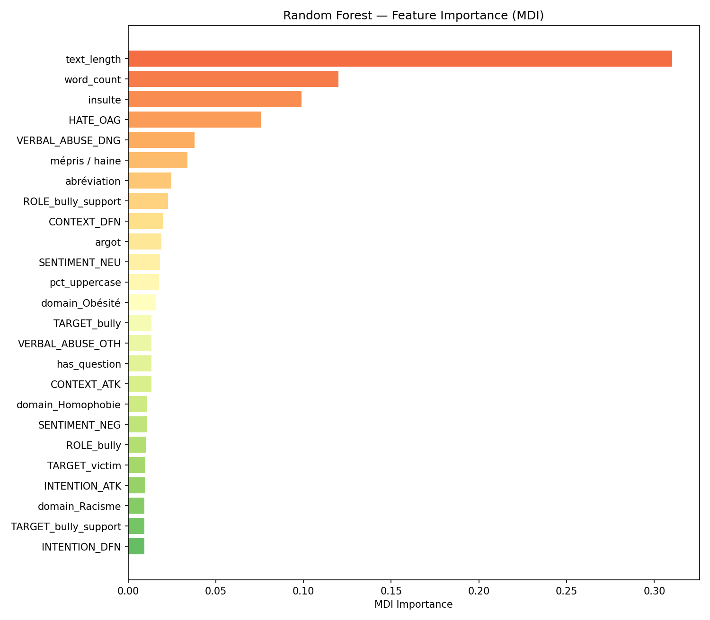

| Rank | Feature | MDI Importance |
|-----:|---------|---------------:|
| 1 | text_length | 0.3102 |
| 2 | word_count | 0.1199 |
| 3 | insulte | 0.0989 |
| 4 | HATE_OAG | 0.0758 |
| 5 | VERBAL_ABUSE_DNG | 0.0380 |
| 6 | mépris / haine | 0.0337 |
| 7 | abréviation | 0.0246 |
| 8 | ROLE_bully_support | 0.0227 |
| 9 | CONTEXT_DFN | 0.0200 |
| 10 | argot | 0.0189 |
| 11 | SENTIMENT_NEU | 0.0182 |
| 12 | pct_uppercase | 0.0175 |
| 13 | domain_Obésité | 0.0159 |
| 14 | TARGET_bully | 0.0135 |
| 15 | VERBAL_ABUSE_OTH | 0.0135 |


### SHAP Analysis

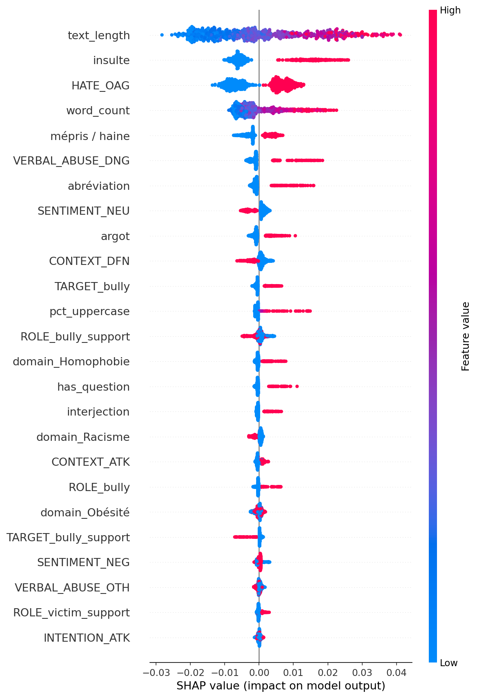

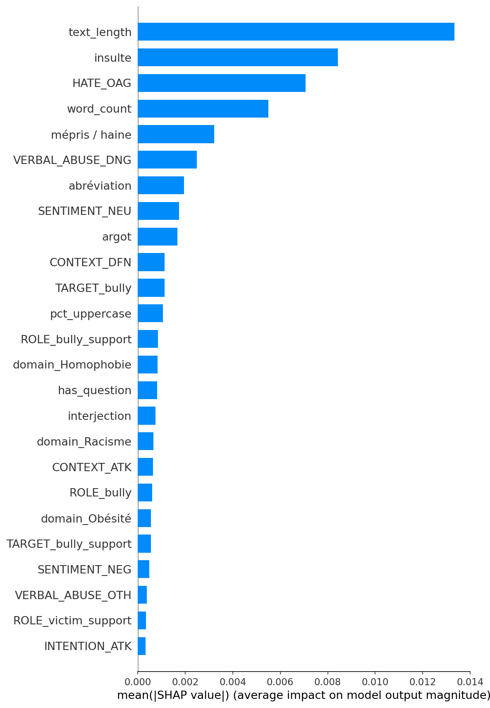


### Decision Tree Rules (depth=4)

```
|--- text_length <= 38.50
|   |--- HATE_OAG <= 0.50
|   |   |--- pct_uppercase <= 0.03
|   |   |   |--- text_length <= 17.50
|   |   |   |   |--- value: [0.01]
|   |   |   |--- text_length >  17.50
|   |   |   |   |--- value: [0.03]
|   |   |--- pct_uppercase >  0.03
|   |   |   |--- value: [0.08]
|   |--- HATE_OAG >  0.50
|   |   |--- insulte <= 0.50
|   |   |   |--- domain_Homophobie <= 0.50
|   |   |   |   |--- value: [0.05]
|   |   |   |--- domain_Homophobie >  0.50
|   |   |   |   |--- value: [0.10]
|   |   |--- insulte >  0.50
|   |   |   |--- ROLE_bully_support <= 0.50
|   |   |   |   |--- value: [0.10]
|   |   |   |--- ROLE_bully_support >  0.50
|   |   |   |   |--- value: [0.06]
|--- text_length >  38.50
|   |--- VERBAL_ABUSE_DNG <= 0.50
|   |   |--- text_length <= 68.00
|   |   |   |--- insulte <= 0.50
|   |   |   |   |--- value: [0.07]
|   |   |   |--- insulte >  0.50
|   |   |   |   |--- value: [0.10]
|   |   |--- text_length >  68.00
|   |   |   |--- TARGET_victim <= 0.50
|   |   |   |   |--- value: [0.09]
|   |   |   |--- TARGET_victim >  0.50
|   |   |   |   |--- value: [0.14]
|   |--- VERBAL_ABUSE_DNG >  0.50
|   |   |--- INTENTION_ATK <= 0.50
|   |   |   |--- value: [0.11]
|   |   |--- INTENTION_ATK >  0.50
|   |   |   |--- value: [0.15]

```


### Bivariate Interactions

| Pair | Error Range | Max | Min |
|------|----------:|----|----:|
| ROLE × CONTEXT | 0.119 | 0.119 | 0.000 |
| VERBAL_ABUSE × CONTEXT | 0.117 | 0.150 | 0.033 |
| INTENTION × CONTEXT | 0.108 | 0.125 | 0.017 |
| VERBAL_ABUSE × interjection | 0.099 | 0.144 | 0.045 |
| CONTEXT × insulte | 0.098 | 0.135 | 0.037 |
| HATE × CONTEXT | 0.097 | 0.105 | 0.008 |
| INTENTION × domain | 0.091 | 0.103 | 0.013 |
| HATE × elongation | 0.090 | 0.130 | 0.039 |
| INTENTION × elongation | 0.090 | 0.120 | 0.030 |
| VERBAL_ABUSE × domain | 0.090 | 0.142 | 0.052 |


## 10. Synthesis & Recommendations


### Key Findings

1. **Dominant error label**: `Colère` has the highest FN rate (0.283), indicating the model frequently misses this emotion.

2. **Structural weakness**: 69/781 samples (8.8%) have an emotion predicted without any expression mode — the most prevalent annotation scheme violation.

3. **Density-error relationship**: Error increases with label density (ρ=0.739), confirming the hypothesis that denser vectors degrade performance.

4. **Threshold optimization**: Lowering mode thresholds for Comportementale→0.18, Désignée→0.05, Montrée→0.05, Suggérée→0.07 could reduce annotation scheme violations.

### Recommendations

1. **Post-processing cascade**: Implement logical rules after thresholding to enforce annotation scheme consistency (∀ emotion → Emo=1; ∀ emotion → at least one mode).

2. **Mode threshold calibration**: Use the Pareto-optimal thresholds from the sweep analysis to balance F1 and structural consistency.

3. **Context disabled for OOD**: Based on prior sanity checks, context should be disabled for OOD data (−9pp coherence degradation).

4. **Monitor density at inference time**: Inputs with high label density (many concurrent emotions) should be flagged for potential degraded performance.
