# EMOTYC Error Analysis — Comprehensive Report

> Generated: 2026-04-20 20:35
> Configuration: `context=no, thresholds=0.5`

**Dataset**: 781 samples across 4 domains

| Domain | N | % |
|--------|--:|--:|
| Homophobie | 103 | 13.2% |
| Obésité | 373 | 47.8% |
| Racisme | 201 | 25.7% |
| Religion | 104 | 13.3% |

**Labels evaluated**: 12 (Colère, Dégoût, Joie, Peur, Surprise, Tristesse...)


## 1. Global Error Metrics

| Metric | Value |
|--------|------:|
| Hamming Error (mean) | 0.0676 |
| Hamming Error (median) | 0.0833 |
| Jaccard Error (mean) | 0.5418 |
| Weighted Hamming (mean) | 0.0164 |
| Exact Match rate | 0.4302 |


### Per-domain breakdown

| Domain | Mean | Median | Exact Match |
|--------|-----:|-------:|------------:|
| Homophobie | 0.0809 | 0.0833 | 0.3398 |
| Obésité | 0.0634 | 0.0833 | 0.4370 |
| Racisme | 0.0609 | 0.0833 | 0.4925 |
| Religion | 0.0825 | 0.0833 | 0.3750 |


## 2. Per-Label Error Decomposition

| Label | Prevalence | FP rate | FN rate | Accuracy | n_FP | n_FN |
|-------|----------:|---------:|--------:|---------:|-----:|-----:|
| Colère | 0.444 | 0.0499 | 0.3431 | 0.6069 | 39 | 268 |
| Dégoût | 0.108 | 0.0000 | 0.1076 | 0.8924 | 0 | 84 |
| Joie | 0.035 | 0.0141 | 0.0256 | 0.9603 | 11 | 20 |
| Peur | 0.009 | 0.0038 | 0.0038 | 0.9923 | 3 | 3 |
| Surprise | 0.005 | 0.0051 | 0.0038 | 0.9910 | 4 | 3 |
| Tristesse | 0.018 | 0.0230 | 0.0154 | 0.9616 | 18 | 12 |
| Admiration | 0.001 | 0.0000 | 0.0013 | 0.9987 | 0 | 1 |
| Culpabilité | 0.004 | 0.0000 | 0.0038 | 0.9962 | 0 | 3 |
| Embarras | 0.001 | 0.0256 | 0.0000 | 0.9744 | 20 | 0 |
| Fierté | 0.005 | 0.0026 | 0.0013 | 0.9962 | 2 | 1 |
| Jalousie | 0.008 | 0.0000 | 0.0077 | 0.9923 | 0 | 6 |
| Autre | 0.078 | 0.1076 | 0.0666 | 0.8259 | 84 | 52 |

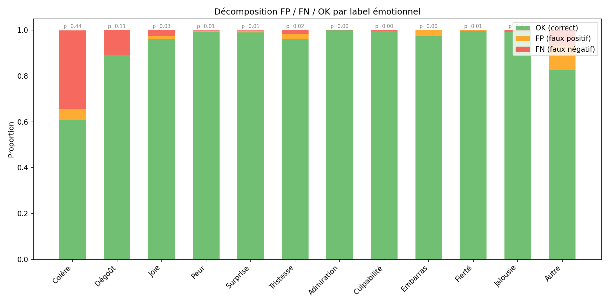


## 3. Annotation Scheme Violations

> [!WARNING]
> These violations indicate structural inconsistencies in the model's predictions.

| Violation Type | Count | Rate |
|----------------|------:|-----:|
| emo_no_emotion | 16 | 2.0% |
| emotion_no_emo | 6 | 0.8% |
| base_no_basic | 5 | 0.6% |
| basic_no_base | 26 | 3.3% |
| complex_no_cpx | 3 | 0.4% |
| cpx_no_complex | 94 | 12.0% |
| mode_no_emotion | 17 | 2.2% |
| emotion_no_mode | 69 | 8.8% |
| **ANY violation** | **135** | **17.3%** |

> [!IMPORTANT]
> The dominant violation is **emotion without mode** (8.8%), confirming the structural weakness identified in previous sanity checks.


## 4. Brier Score Decomposition

The Brier score decomposes as: `BS = reliability − resolution + uncertainty`

- **Reliability** (↓ better): calibration error
- **Resolution** (↑ better): discriminative power
- **Uncertainty**: inherent data entropy (fixed)

| Label | Brier | Reliability | Resolution | Uncertainty | ECE |
|-------|------:|----------:|----------:|----------:|----:|
| Colère | 0.3726 | 0.1389 | 0.0138 | 0.2469 | 0.3671 |
| Dégoût | 0.1061 | 0.0110 | 0.0000 | 0.0960 | 0.1051 |
| Joie | 0.0379 | 0.0088 | 0.0042 | 0.0334 | 0.0367 |
| Peur | 0.0075 | 0.0020 | 0.0033 | 0.0089 | 0.0067 |
| Surprise | 0.0087 | 0.0039 | 0.0003 | 0.0051 | 0.0085 |
| Tristesse | 0.0345 | 0.0174 | 0.0003 | 0.0176 | 0.0371 |
| Admiration | 0.0013 | 0.0000 | 0.0000 | 0.0013 | 0.0006 |
| Culpabilité | 0.0038 | 0.0000 | 0.0000 | 0.0038 | 0.0029 |
| Embarras | 0.0180 | 0.0170 | 0.0003 | 0.0013 | 0.0255 |
| Fierté | 0.0032 | 0.0019 | 0.0038 | 0.0051 | 0.0035 |
| Jalousie | 0.0077 | 0.0001 | 0.0000 | 0.0076 | 0.0076 |
| Autre | 0.1568 | 0.0854 | 0.0006 | 0.0720 | 0.1640 |
| Comportementale | 0.0993 | 0.0152 | 0.0095 | 0.0940 | 0.0985 |
| Désignée | 0.0744 | 0.0198 | 0.0092 | 0.0644 | 0.0728 |
| Montrée | 0.3492 | 0.1199 | 0.0111 | 0.2404 | 0.3435 |
| Suggérée | 0.0848 | 0.0121 | 0.0032 | 0.0763 | 0.0828 |

> [!NOTE]
> Mean ECE for emotions = 0.0638, for modes = 0.1494. Modes are worse calibrated.


## 5. Conditional Error Analysis (Modes ↔ Emotions)


### Which modes degrade emotion detection?

Δ F1 = F1(emotion | mode present) − F1(emotion global). **Negative = degradation** when this mode is present.

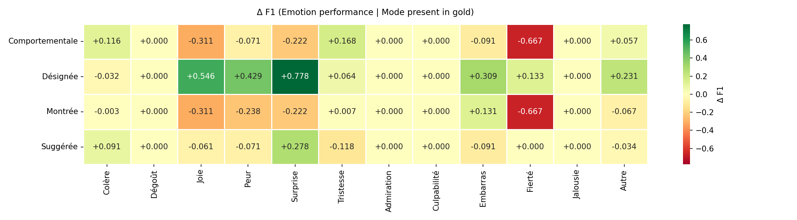

**Top degradations** (mode → emotion):

- `Comportementale` → `Fierté`: Δ F1 = -0.667 (F1=0.000, n=82)
- `Montrée` → `Fierté`: Δ F1 = -0.667 (F1=0.000, n=314)
- `Comportementale` → `Joie`: Δ F1 = -0.311 (F1=0.000, n=82)
- `Montrée` → `Joie`: Δ F1 = -0.311 (F1=0.000, n=314)
- `Montrée` → `Peur`: Δ F1 = -0.238 (F1=0.333, n=314)
- `Comportementale` → `Surprise`: Δ F1 = -0.222 (F1=0.000, n=82)
- `Montrée` → `Surprise`: Δ F1 = -0.222 (F1=0.000, n=314)
- `Suggérée` → `Tristesse`: Δ F1 = -0.118 (F1=0.000, n=65)


### Which emotions degrade mode detection?

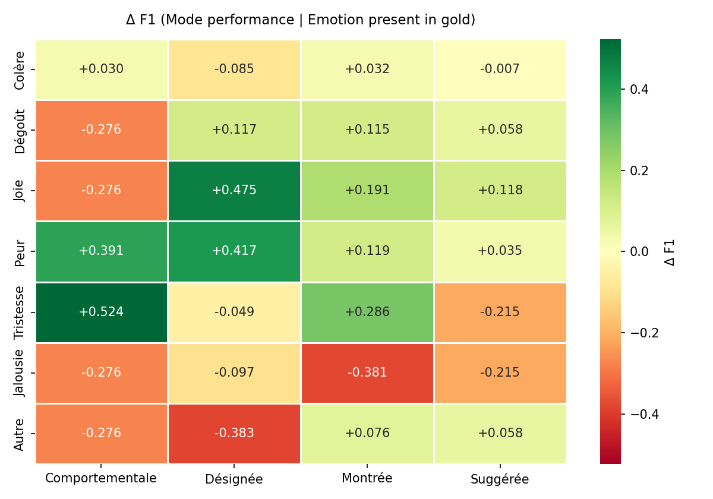


## 6. Interaction & Combination Analysis

**Interaction effect** = observed error − expected error under additivity.

- **Positive (conflict)**: the combination performs *worse* than expected
- **Negative (synergy)**: the combination performs *better* than expected

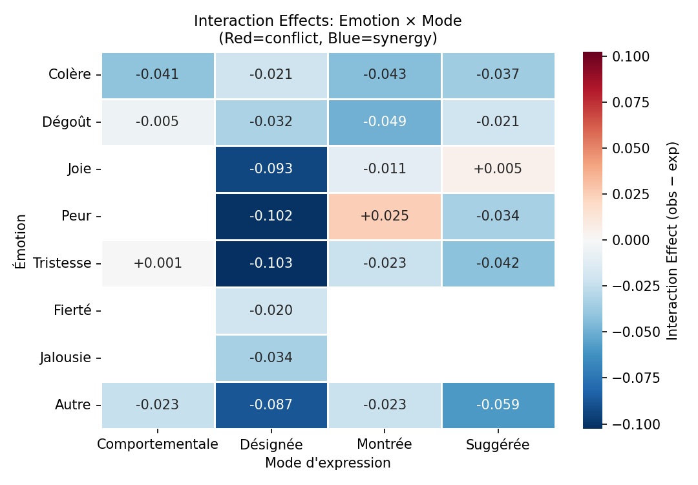


### Top Conflicts (worse than expected)

| Emotion | Mode | Observed | Expected | Δ | n |
|---------|------|--------:|---------:|--:|--:|
| Peur | Montrée | 0.167 | 0.142 | +0.025 | 3 |
| Joie | Suggérée | 0.167 | 0.161 | +0.005 | 7 |
| Tristesse | Comportementale | 0.167 | 0.166 | +0.001 | 3 |


### Top Synergies (better than expected)

| Emotion | Mode | Observed | Expected | Δ | n |
|---------|------|--------:|---------:|--:|--:|
| Tristesse | Désignée | 0.062 | 0.165 | -0.103 | 4 |
| Peur | Désignée | 0.028 | 0.129 | -0.102 | 3 |
| Joie | Désignée | 0.052 | 0.145 | -0.093 | 8 |
| Autre | Désignée | 0.083 | 0.171 | -0.087 | 10 |
| Autre | Suggérée | 0.128 | 0.187 | -0.059 | 13 |
| Dégoût | Montrée | 0.162 | 0.211 | -0.049 | 75 |
| Colère | Montrée | 0.112 | 0.155 | -0.043 | 274 |
| Tristesse | Suggérée | 0.139 | 0.181 | -0.042 | 6 |
| Colère | Comportementale | 0.103 | 0.143 | -0.041 | 78 |
| Colère | Suggérée | 0.122 | 0.159 | -0.036 | 47 |

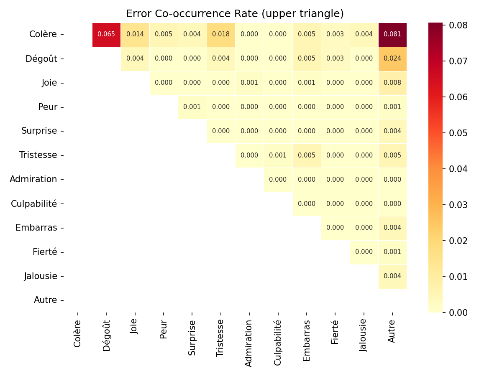


### Combination Profiles

73 unique label configurations found.

**Highest-error profiles:**

| Active Labels | n | Mean Error | Density |
|---------------|--:|-----------:|--------:|
| Colère, Dégoût, Autre, Comportementale, Montrée | 1 | 0.333 | 5 |
| Dégoût, Joie, Montrée, Suggérée | 1 | 0.250 | 4 |
| Colère, Surprise, Montrée | 1 | 0.250 | 3 |
| Colère, Joie, Montrée, Suggérée | 1 | 0.250 | 4 |
| Colère, Dégoût, Comportementale, Suggérée | 1 | 0.250 | 4 |


## 7. Logit & Threshold Analysis


### Logit Separation

Higher separation = better discriminability. Labels with low separation cannot be reliably classified regardless of threshold.

| Label | n+ | n− | Separation | p̄(gold=1) | p̄(gold=0) | Overlap |
|-------|---:|---:|-----------:|----------:|---------:|--------:|
| Colère | 347 | 434 | +2.38 | 0.228 | 0.090 | 0.802 |
| Dégoût | 84 | 697 | +1.54 | 0.007 | 0.002 | 0.933 |
| Joie | 27 | 754 | +5.31 | 0.284 | 0.017 | 0.645 |
| Peur | 7 | 774 | +10.76 | 0.573 | 0.007 | 0.430 |
| Surprise | 4 | 777 | +4.38 | 0.250 | 0.007 | 0.754 |
| Tristesse | 14 | 767 | +4.87 | 0.150 | 0.024 | 0.738 |
| Admiration | 1 | 780 | -0.91 | 0.000 | 0.001 | 0.989 |
| Culpabilité | 3 | 778 | +1.35 | 0.004 | 0.001 | 0.987 |
| Embarras | 1 | 780 | +13.10 | 0.773 | 0.026 | 0.001 |
| Fierté | 4 | 777 | +10.64 | 0.700 | 0.004 | 0.250 |
| Jalousie | 6 | 775 | +1.59 | 0.000 | 0.000 | 1.000 |
| Autre | 61 | 720 | +1.53 | 0.167 | 0.127 | 0.782 |
| Comportementale | 82 | 699 | +2.43 | 0.121 | 0.016 | 0.760 |
| Désignée | 54 | 727 | +5.59 | 0.286 | 0.036 | 0.587 |
| Montrée | 314 | 467 | +2.16 | 0.232 | 0.101 | 0.808 |
| Suggérée | 65 | 716 | +1.42 | 0.067 | 0.022 | 0.779 |
| Emo | 438 | 343 | +3.91 | 0.453 | 0.182 | 0.690 |
| Base | 401 | 380 | +2.91 | 0.273 | 0.086 | 0.749 |
| Complexe | 15 | 766 | +5.47 | 0.286 | 0.030 | 0.613 |

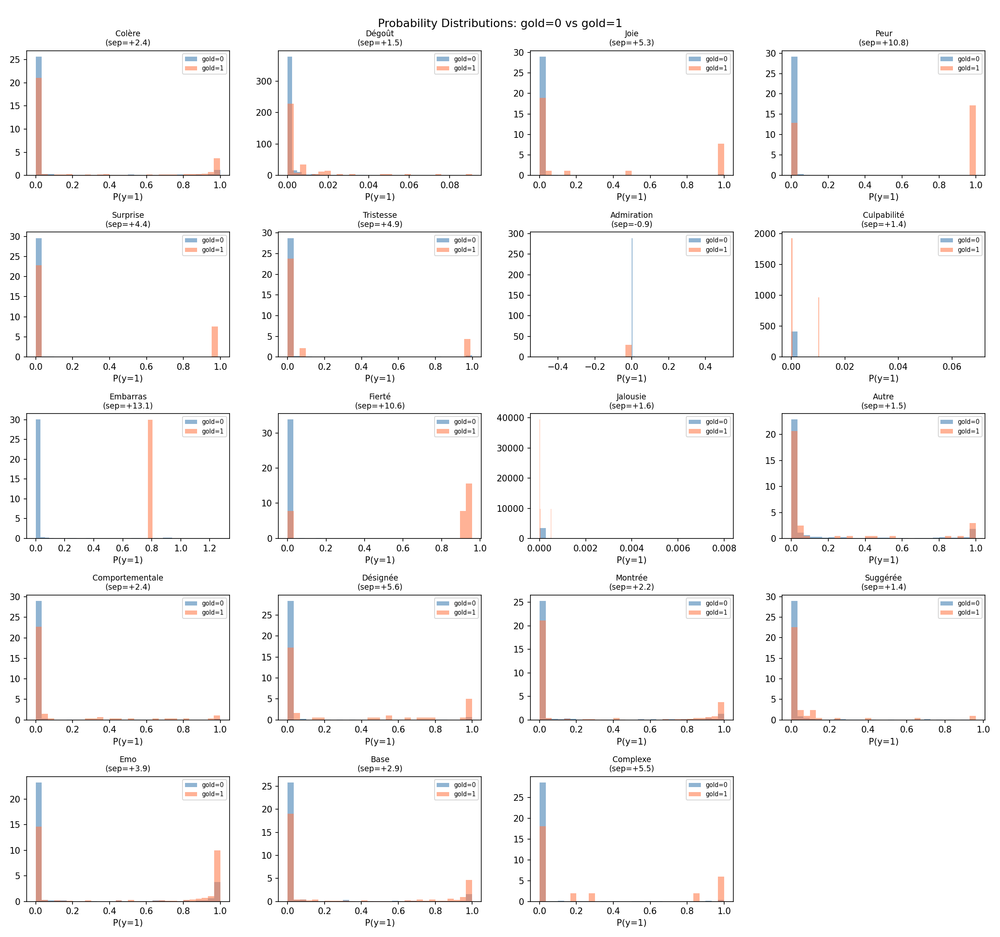


### Threshold Sweep for Expression Modes

> [!TIP]
> Custom mode thresholds can reduce annotation scheme violations while preserving or improving F1.

| Mode | Current θ | Optimal θ | F1@0.5 | F1@opt |
|------|----------:|----------:|------:|-------:|
| Comportementale | 0.500 | 0.060 | 0.178 | 0.276 |
| Désignée | 0.500 | 0.050 | 0.337 | 0.383 |
| Montrée | 0.500 | 0.050 | 0.336 | 0.384 |
| Suggérée | 0.500 | 0.070 | 0.076 | 0.222 |

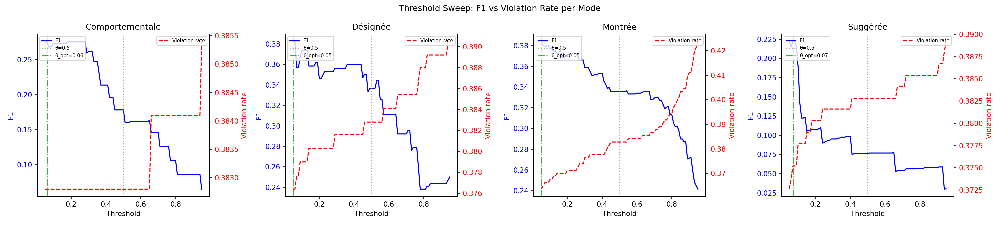


### Calibration

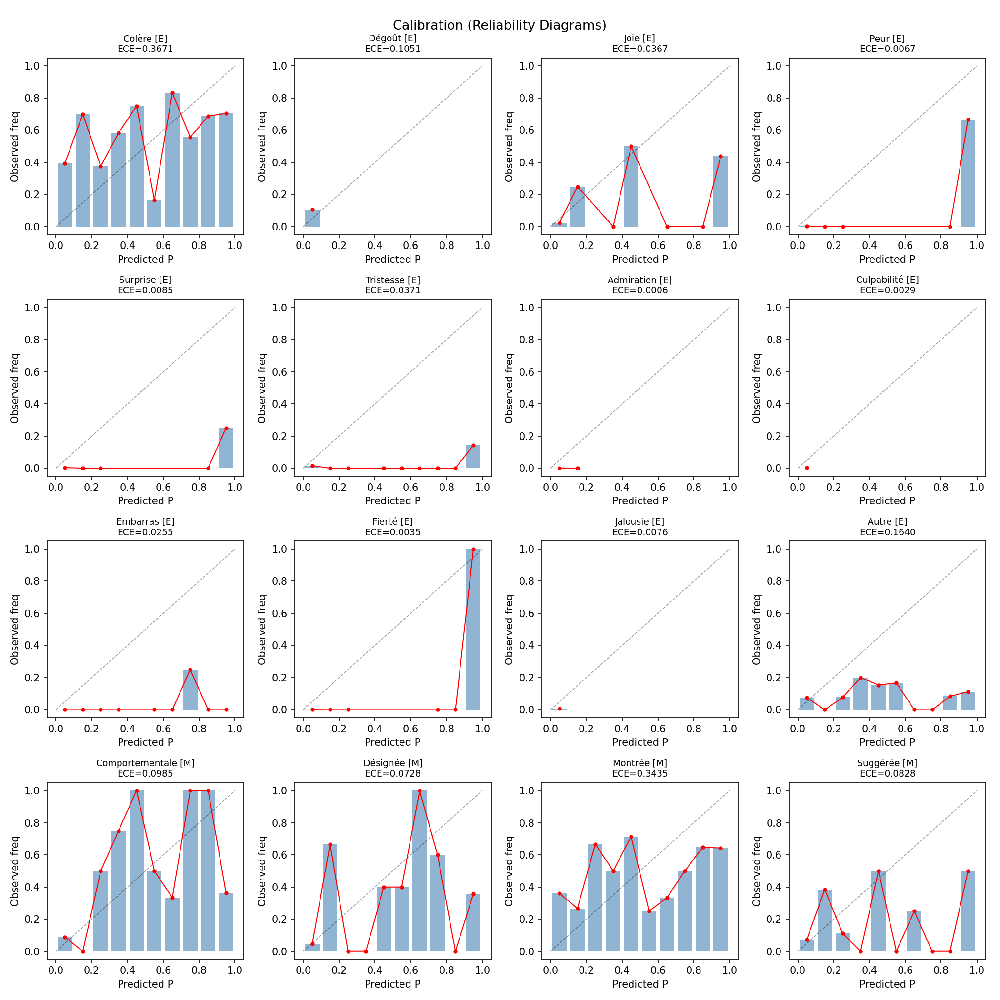


## 8. Density & Length Stratification


### Density-stratified performance

**Spearman correlation** (density vs Hamming): ρ = 0.741, p = 5.75e-137 ***

| Density Bin | Range | n | Mean Error | Exact Match |
|-------------|-------|--:|-----------:|-----------:|
| 0 | [0, 0] | 343 | 0.0165 | 0.810 |
| 1 | [1, 1] | 330 | 0.0891 | 0.176 |
| 2 | [2, 2] | 95 | 0.1570 | 0.000 |
| 3 | [3, 3] | 13 | 0.2179 | 0.000 |

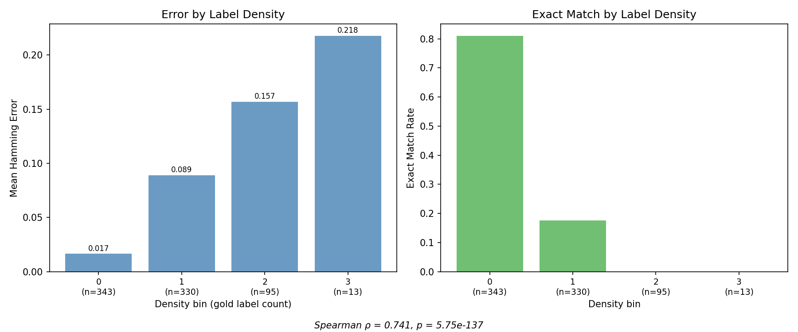


### Domain-controlled density effect

Testing whether the density→error relationship survives within individual domains:

| Domain | n | Mean Density | Mean Error | ρ | p |
|--------|--:|------------:|-----------:|--:|--:|
| Homophobie | 103 | 0.77 | 0.0809 | 0.672 | 7.99e-15 *** |
| Obésité | 373 | 0.70 | 0.0634 | 0.746 | 1.99e-67 *** |
| Racisme | 201 | 0.66 | 0.0609 | 0.818 | 1.13e-49 *** |
| Religion | 104 | 0.84 | 0.0825 | 0.668 | 8.97e-15 *** |


### Length-stratified performance

**Spearman correlation** (word_count vs Hamming): ρ = 0.306, p = 2.14e-18 ***

Kruskal-Wallis: H=72.4403, p=1.86e-16, direction=increasing

| Length Bin | Range | n | Mean Error | Exact Match |
|-----------|-------|--:|-----------:|-----------:|
| short | [0, 4] | 264 | 0.0445 | 0.576 |
| medium | [5, 8] | 277 | 0.0626 | 0.433 |
| long | [9, 32] | 240 | 0.0990 | 0.267 |


### Cross-stratification (Density × Length)

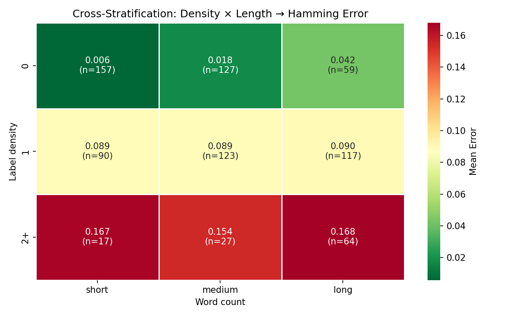

> [!CAUTION]
> **Danger zones** — combinations with highest error rates:
>
> - density=2+, length=long: mean_error=0.1680 (n=64)
> - density=2+, length=short: mean_error=0.1667 (n=17)
> - density=2+, length=medium: mean_error=0.1543 (n=27)


## 9. Feature Importance & Explainability


### Univariate Analysis

Features ranked by statistical significance (effect on Hamming error):

| Feature | Test | p-value | η² | Top Level | Mean Error |
|---------|------|--------:|---:|-----------|-----------:|
| insulte | Mann-Whitney U | 1.26e-12 *** | 97.945 | 1 | 0.0975 |
| HATE | Kruskal-Wallis | 1.65e-12 *** | 0.067 | OAG | 0.0835 |
| mépris / haine | Mann-Whitney U | 1.46e-10 *** | 120.480 | 1 | 0.0875 |
| SENTIMENT | Kruskal-Wallis | 2.22e-09 *** | 0.049 | NEG | 0.0766 |
| INTENTION | Kruskal-Wallis | 3.79e-08 *** | 0.053 | DFN | 0.0815 |
| argot | Mann-Whitney U | 4.46e-04 *** | 73.165 | 1 | 0.0839 |
| abréviation | Mann-Whitney U | 5.01e-04 *** | 29.096 | 1 | 0.0904 |
| domain | Kruskal-Wallis | 7.48e-03 ** | 0.011 | Religion | 0.0825 |
| VERBAL_ABUSE | Kruskal-Wallis | 1.05e-02 * | 0.016 | DNG | 0.1037 |
| interjection | Mann-Whitney U | 1.99e-02 * | 31.404 | 1 | 0.0864 |
| elongation | Mann-Whitney U | 2.82e-02 * | 5.920 | 1 | 0.1029 |
| ROLE | Kruskal-Wallis | 2.98e-02 * | 0.009 | bully | 0.0773 |


### Random Forest Regressor

- OOB R²: 0.1786

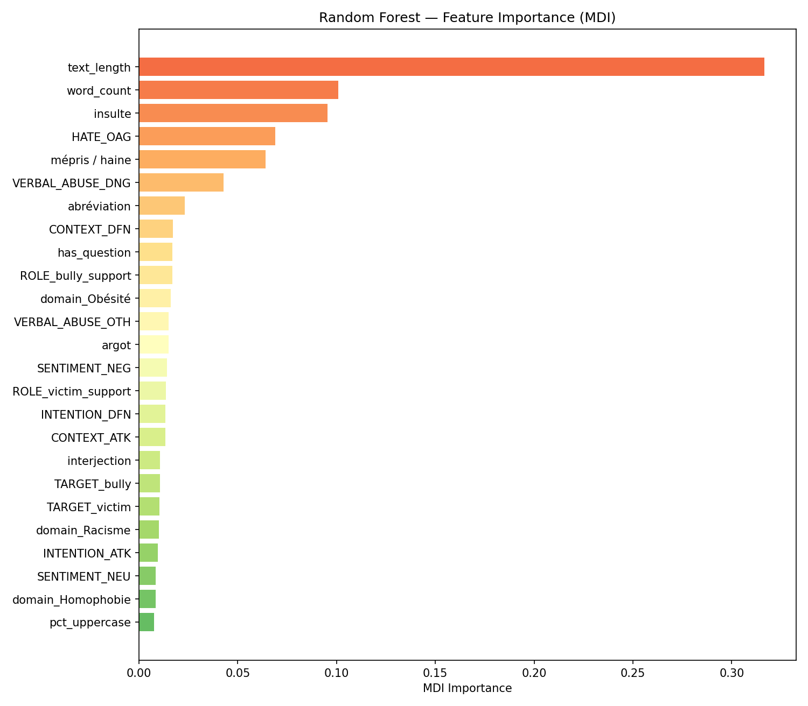

| Rank | Feature | MDI Importance |
|-----:|---------|---------------:|
| 1 | text_length | 0.3167 |
| 2 | word_count | 0.1009 |
| 3 | insulte | 0.0955 |
| 4 | HATE_OAG | 0.0689 |
| 5 | mépris / haine | 0.0641 |
| 6 | VERBAL_ABUSE_DNG | 0.0428 |
| 7 | abréviation | 0.0232 |
| 8 | CONTEXT_DFN | 0.0172 |
| 9 | has_question | 0.0169 |
| 10 | ROLE_bully_support | 0.0169 |
| 11 | domain_Obésité | 0.0160 |
| 12 | VERBAL_ABUSE_OTH | 0.0150 |
| 13 | argot | 0.0149 |
| 14 | SENTIMENT_NEG | 0.0143 |
| 15 | ROLE_victim_support | 0.0137 |


### SHAP Analysis

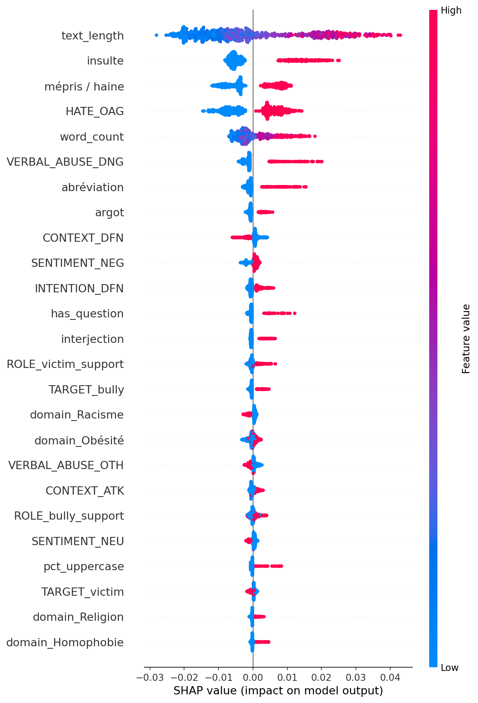

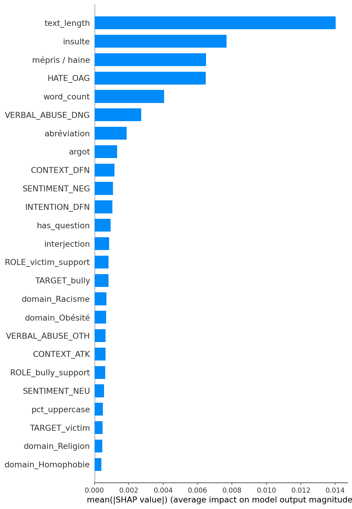


### Decision Tree Rules (depth=4)

```
|--- text_length <= 43.50
|   |--- insulte <= 0.50
|   |   |--- HATE_OAG <= 0.50
|   |   |   |--- text_length <= 17.50
|   |   |   |   |--- value: [0.02]
|   |   |   |--- text_length >  17.50
|   |   |   |   |--- value: [0.04]
|   |   |--- HATE_OAG >  0.50
|   |   |   |--- mépris / haine <= 0.50
|   |   |   |   |--- value: [0.05]
|   |   |   |--- mépris / haine >  0.50
|   |   |   |   |--- value: [0.08]
|   |--- insulte >  0.50
|   |   |--- text_length <= 33.50
|   |   |   |--- ROLE_bully <= 0.50
|   |   |   |   |--- value: [0.08]
|   |   |   |--- ROLE_bully >  0.50
|   |   |   |   |--- value: [0.10]
|   |   |--- text_length >  33.50
|   |   |   |--- CONTEXT_ATK <= 0.50
|   |   |   |   |--- value: [0.14]
|   |   |   |--- CONTEXT_ATK >  0.50
|   |   |   |   |--- value: [0.09]
|--- text_length >  43.50
|   |--- VERBAL_ABUSE_DNG <= 0.50
|   |   |--- has_question <= 0.50
|   |   |   |--- mépris / haine <= 0.50
|   |   |   |   |--- value: [0.07]
|   |   |   |--- mépris / haine >  0.50
|   |   |   |   |--- value: [0.11]
|   |   |--- has_question >  0.50
|   |   |   |--- value: [0.13]
|   |--- VERBAL_ABUSE_DNG >  0.50
|   |   |--- text_length <= 62.50
|   |   |   |--- value: [0.13]
|   |   |--- text_length >  62.50
|   |   |   |--- value: [0.15]

```


### Bivariate Interactions

| Pair | Error Range | Max | Min |
|------|----------:|----|----:|
| VERBAL_ABUSE × CONTEXT | 0.136 | 0.183 | 0.048 |
| ROLE × CONTEXT | 0.119 | 0.119 | 0.000 |
| VERBAL_ABUSE × ironie | 0.107 | 0.167 | 0.060 |
| INTENTION × domain | 0.103 | 0.116 | 0.013 |
| CONTEXT × domain | 0.102 | 0.119 | 0.017 |
| HATE × domain | 0.102 | 0.135 | 0.033 |
| VERBAL_ABUSE × interjection | 0.102 | 0.159 | 0.057 |
| CONTEXT × SENTIMENT | 0.099 | 0.099 | 0.000 |
| INTENTION × interjection | 0.098 | 0.121 | 0.023 |
| INTENTION × CONTEXT | 0.098 | 0.115 | 0.017 |


## 10. Synthesis & Recommendations


### Key Findings

1. **Dominant error label**: `Colère` has the highest FN rate (0.343), indicating the model frequently misses this emotion.

2. **Structural weakness**: 69/781 samples (8.8%) have an emotion predicted without any expression mode — the most prevalent annotation scheme violation.

3. **Density-error relationship**: Error increases with label density (ρ=0.741), confirming the hypothesis that denser vectors degrade performance.

4. **Threshold optimization**: Lowering mode thresholds for Comportementale→0.06, Désignée→0.05, Montrée→0.05, Suggérée→0.07 could reduce annotation scheme violations.

### Recommendations

1. **Post-processing cascade**: Implement logical rules after thresholding to enforce annotation scheme consistency (∀ emotion → Emo=1; ∀ emotion → at least one mode).

2. **Mode threshold calibration**: Use the Pareto-optimal thresholds from the sweep analysis to balance F1 and structural consistency.

3. **Context disabled for OOD**: Based on prior sanity checks, context should be disabled for OOD data (−9pp coherence degradation).

4. **Monitor density at inference time**: Inputs with high label density (many concurrent emotions) should be flagged for potential degraded performance.
