# EMOTYC Error Analysis — Comprehensive Report

> Generated: 2026-06-12 17:49
> Configuration: `context=no, thresholds=optimized`

**Dataset**: 781 samples across 1 domains

| Domain | N | % |
|--------|--:|--:|
| CyberAggAdo | 781 | 100.0% |

**Labels evaluated**: 12 (Colère, Dégoût, Joie, Peur, Surprise, Tristesse...)


## 1. Global Error Metrics

| Metric | Value |
|--------|------:|
| Hamming Error (mean) | 0.0604 |
| Hamming Error (median) | 0.0833 |
| Jaccard Error (mean) | 0.4955 |
| Weighted Hamming (mean) | 0.0122 |
| Exact Match rate | 0.4802 |


### Per-domain breakdown

| Domain | Mean | Median | Exact Match |
|--------|-----:|-------:|------------:|
| CyberAggAdo | 0.0604 | 0.0833 | 0.4802 |


## 2. Per-Label Error Decomposition

| Label | Prevalence | FP rate | FN rate | Accuracy | n_FP | n_FN |
|-------|----------:|---------:|--------:|---------:|-----:|-----:|
| Colère | 0.370 | 0.0755 | 0.2702 | 0.6543 | 59 | 211 |
| Dégoût | 0.102 | 0.0000 | 0.1024 | 0.8976 | 0 | 80 |
| Joie | 0.038 | 0.0090 | 0.0269 | 0.9641 | 7 | 21 |
| Peur | 0.005 | 0.0038 | 0.0026 | 0.9936 | 3 | 2 |
| Surprise | 0.006 | 0.0026 | 0.0038 | 0.9936 | 2 | 3 |
| Tristesse | 0.018 | 0.0192 | 0.0154 | 0.9654 | 15 | 12 |
| Admiration | 0.000 | 0.0000 | 0.0000 | 1.0000 | 0 | 0 |
| Culpabilité | 0.004 | 0.0000 | 0.0038 | 0.9962 | 0 | 3 |
| Embarras | 0.003 | 0.0000 | 0.0026 | 0.9974 | 0 | 2 |
| Fierté | 0.004 | 0.0013 | 0.0000 | 0.9987 | 1 | 0 |
| Jalousie | 0.008 | 0.0000 | 0.0077 | 0.9923 | 0 | 6 |
| Autre | 0.079 | 0.1088 | 0.0691 | 0.8220 | 85 | 54 |

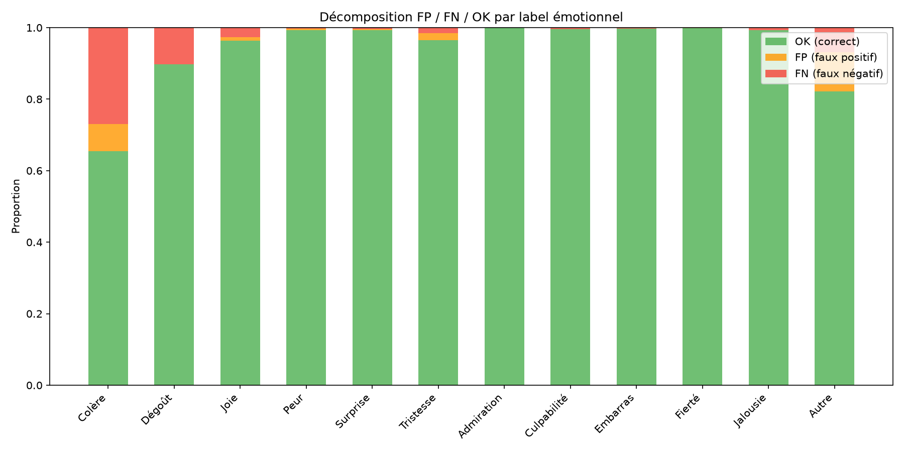


## 3. Annotation Scheme Violations

> [!WARNING]
> These violations indicate structural inconsistencies in the model's predictions.

| Violation Type | Count | Rate |
|----------------|------:|-----:|
| emo_no_emotion | 22 | 2.8% |
| emotion_no_emo | 8 | 1.0% |
| base_no_basic | 6 | 0.8% |
| basic_no_base | 37 | 4.7% |
| complex_no_cpx | 22 | 2.8% |
| cpx_no_complex | 92 | 11.8% |
| mode_no_emotion | 23 | 2.9% |
| emotion_no_mode | 71 | 9.1% |
| **ANY violation** | **154** | **19.7%** |

> [!IMPORTANT]
> The dominant violation is **emotion without mode** (9.1%), confirming the structural weakness identified in previous sanity checks.


## 4. Brier Score Decomposition

The Brier score decomposes as: `BS = reliability − resolution + uncertainty`

- **Reliability** (↓ better): calibration error
- **Resolution** (↑ better): discriminative power
- **Uncertainty**: inherent data entropy (fixed)

| Label | Brier | Reliability | Resolution | Uncertainty | ECE |
|-------|------:|----------:|----------:|----------:|----:|
| Colère | 0.3260 | 0.1032 | 0.0104 | 0.2331 | 0.3160 |
| Dégoût | 0.1009 | 0.0100 | 0.0000 | 0.0919 | 0.1000 |
| Joie | 0.0345 | 0.0053 | 0.0078 | 0.0369 | 0.0332 |
| Peur | 0.0088 | 0.0045 | 0.0008 | 0.0051 | 0.0080 |
| Surprise | 0.0075 | 0.0023 | 0.0013 | 0.0064 | 0.0072 |
| Tristesse | 0.0345 | 0.0174 | 0.0003 | 0.0176 | 0.0371 |
| Admiration | 0.0001 | 0.0000 | 0.0000 | 0.0000 | 0.0009 |
| Culpabilité | 0.0038 | 0.0000 | 0.0000 | 0.0038 | 0.0029 |
| Embarras | 0.0169 | 0.0149 | 0.0006 | 0.0026 | 0.0242 |
| Fierté | 0.0019 | 0.0019 | 0.0038 | 0.0038 | 0.0040 |
| Jalousie | 0.0077 | 0.0001 | 0.0000 | 0.0076 | 0.0076 |
| Autre | 0.1597 | 0.0875 | 0.0009 | 0.0731 | 0.1653 |
| Comportementale | 0.0444 | 0.0080 | 0.0072 | 0.0440 | 0.0417 |
| Désignée | 0.0712 | 0.0180 | 0.0116 | 0.0655 | 0.0697 |
| Montrée | 0.3424 | 0.1137 | 0.0079 | 0.2366 | 0.3333 |
| Suggérée | 0.0692 | 0.0090 | 0.0038 | 0.0644 | 0.0666 |

> [!NOTE]
> Mean ECE for emotions = 0.0589, for modes = 0.1278. Modes are worse calibrated.


## 5. Conditional Error Analysis (Modes ↔ Emotions)


### Which modes degrade emotion detection?

Δ F1 = F1(emotion | mode present) − F1(emotion global). **Negative = degradation** when this mode is present.

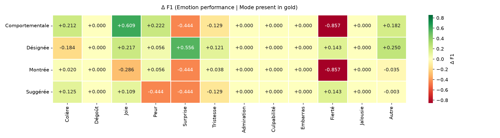

**Top degradations** (mode → emotion):

- `Comportementale` → `Fierté`: Δ F1 = -0.857 (F1=0.000, n=36)
- `Montrée` → `Fierté`: Δ F1 = -0.857 (F1=0.000, n=300)
- `Comportementale` → `Surprise`: Δ F1 = -0.444 (F1=0.000, n=36)
- `Montrée` → `Surprise`: Δ F1 = -0.444 (F1=0.000, n=300)
- `Suggérée` → `Peur`: Δ F1 = -0.444 (F1=0.000, n=54)
- `Suggérée` → `Surprise`: Δ F1 = -0.444 (F1=0.000, n=54)
- `Montrée` → `Joie`: Δ F1 = -0.286 (F1=0.105, n=300)
- `Désignée` → `Colère`: Δ F1 = -0.184 (F1=0.182, n=55)


### Which emotions degrade mode detection?

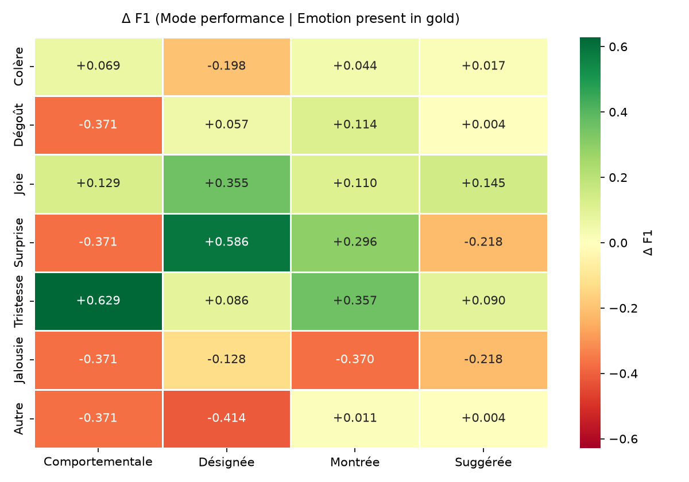


## 6. Interaction & Combination Analysis

**Interaction effect** = observed error − expected error under additivity.

- **Positive (conflict)**: the combination performs *worse* than expected
- **Negative (synergy)**: the combination performs *better* than expected

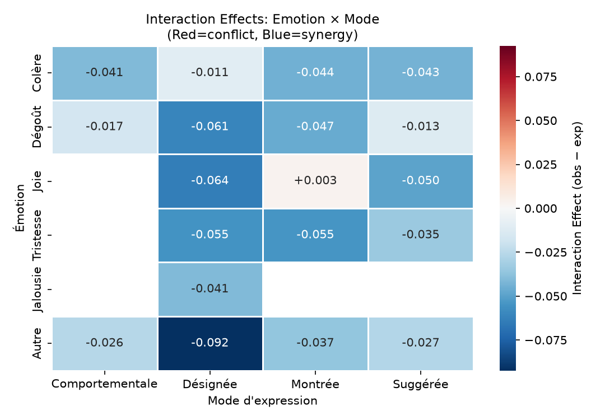


### Top Conflicts (worse than expected)

| Emotion | Mode | Observed | Expected | Δ | n |
|---------|------|--------:|---------:|--:|--:|
| Joie | Montrée | 0.161 | 0.157 | +0.003 | 14 |


### Top Synergies (better than expected)

| Emotion | Mode | Observed | Expected | Δ | n |
|---------|------|--------:|---------:|--:|--:|
| Autre | Désignée | 0.095 | 0.188 | -0.092 | 7 |
| Joie | Désignée | 0.088 | 0.152 | -0.064 | 16 |
| Dégoût | Désignée | 0.129 | 0.190 | -0.061 | 11 |
| Tristesse | Désignée | 0.111 | 0.166 | -0.055 | 6 |
| Tristesse | Montrée | 0.117 | 0.171 | -0.055 | 5 |
| Joie | Suggérée | 0.117 | 0.167 | -0.050 | 5 |
| Dégoût | Montrée | 0.149 | 0.195 | -0.047 | 69 |
| Colère | Montrée | 0.103 | 0.147 | -0.044 | 249 |
| Colère | Suggérée | 0.113 | 0.156 | -0.043 | 40 |
| Colère | Comportementale | 0.094 | 0.135 | -0.041 | 31 |

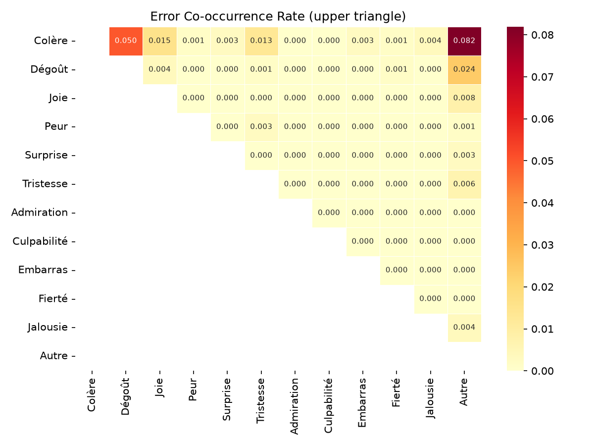


### Combination Profiles

64 unique label configurations found.

**Highest-error profiles:**

| Active Labels | n | Mean Error | Density |
|---------------|--:|-----------:|--------:|
| Tristesse, Autre, Désignée, Suggérée | 1 | 0.250 | 4 |
| Dégoût, Autre, Suggérée | 1 | 0.250 | 3 |
| Joie, Autre, Montrée | 1 | 0.250 | 3 |
| Colère, Dégoût, Autre, Comportementale, Montrée, Suggérée | 1 | 0.250 | 6 |
| Colère, Dégoût, Autre, Montrée, Suggérée | 1 | 0.250 | 5 |


## 7. Logit & Threshold Analysis


### Logit Separation

Higher separation = better discriminability. Labels with low separation cannot be reliably classified regardless of threshold.

| Label | n+ | n− | Separation | p̄(gold=1) | p̄(gold=0) | Overlap |
|-------|---:|---:|-----------:|----------:|---------:|--------:|
| Colère | 289 | 492 | +2.36 | 0.236 | 0.101 | 0.809 |
| Dégoût | 80 | 701 | +1.72 | 0.008 | 0.002 | 0.928 |
| Joie | 30 | 751 | +6.81 | 0.350 | 0.014 | 0.580 |
| Peur | 4 | 777 | +10.18 | 0.503 | 0.010 | 0.504 |
| Surprise | 5 | 776 | +6.34 | 0.398 | 0.005 | 0.603 |
| Tristesse | 14 | 767 | +4.79 | 0.149 | 0.024 | 0.738 |
| Admiration | 0 | 781 | N/A | N/A | N/A | N/A |
| Culpabilité | 3 | 778 | +1.35 | 0.004 | 0.001 | 0.987 |
| Embarras | 2 | 779 | +13.89 | 0.857 | 0.025 | 0.001 |
| Fierté | 3 | 778 | +14.27 | 0.933 | 0.004 | 0.000 |
| Jalousie | 6 | 775 | +1.59 | 0.000 | 0.000 | 1.000 |
| Autre | 62 | 719 | +1.01 | 0.154 | 0.128 | 0.834 |
| Comportementale | 36 | 745 | +4.74 | 0.233 | 0.017 | 0.563 |
| Désignée | 55 | 726 | +5.84 | 0.312 | 0.034 | 0.565 |
| Montrée | 300 | 481 | +2.01 | 0.228 | 0.107 | 0.819 |
| Suggérée | 54 | 727 | +1.89 | 0.092 | 0.021 | 0.756 |
| Emo | 398 | 383 | +4.20 | 0.476 | 0.186 | 0.664 |
| Base | 363 | 418 | +3.16 | 0.293 | 0.085 | 0.729 |
| Complexe | 14 | 767 | +6.96 | 0.377 | 0.028 | 0.512 |

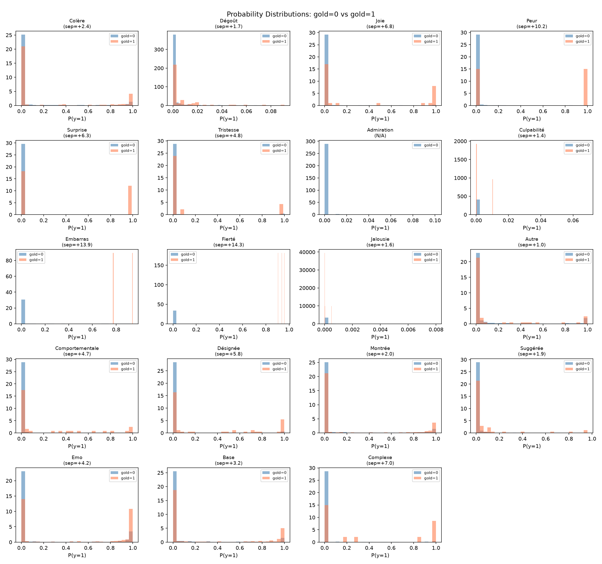


### Threshold Sweep for Expression Modes

> [!TIP]
> Custom mode thresholds can reduce annotation scheme violations while preserving or improving F1.

| Mode | Current θ | Optimal θ | F1@0.5 | F1@opt |
|------|----------:|----------:|------:|-------:|
| Comportementale | 0.500 | 0.180 | 0.291 | 0.381 |
| Désignée | 0.500 | 0.050 | 0.375 | 0.414 |
| Montrée | 0.500 | 0.050 | 0.333 | 0.374 |
| Suggérée | 0.500 | 0.070 | 0.118 | 0.226 |

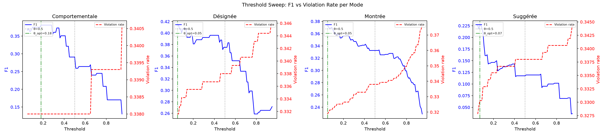


### Calibration

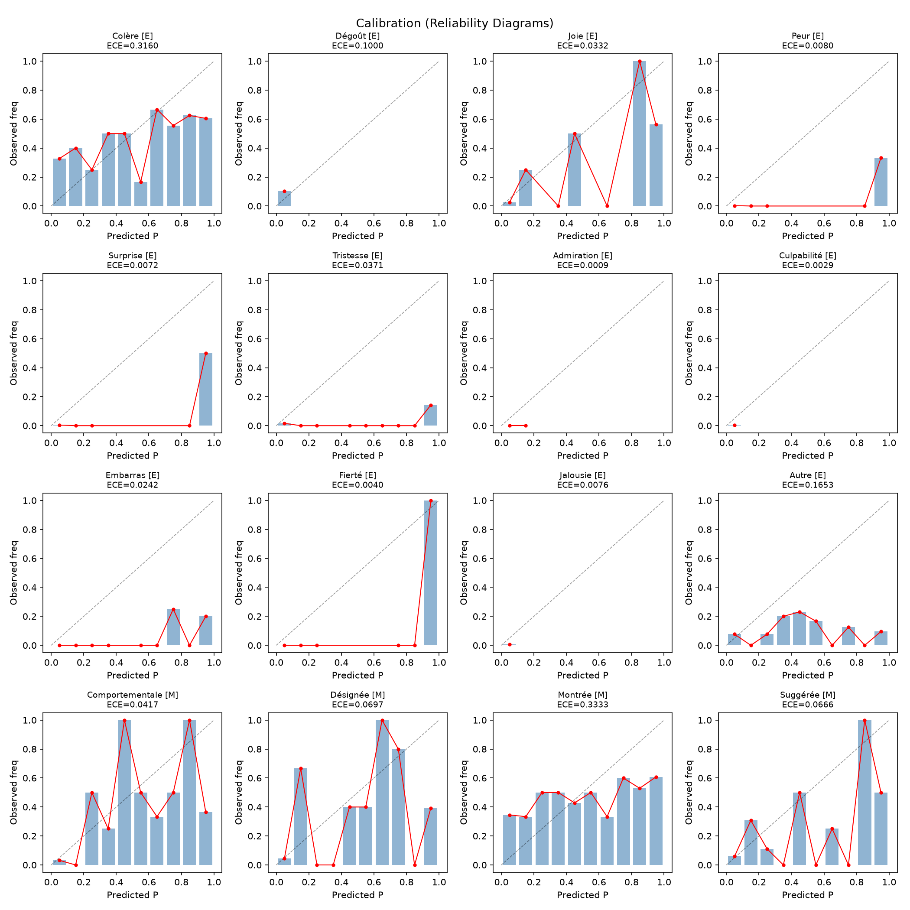


## 8. Density & Length Stratification


### Density-stratified performance

**Spearman correlation** (density vs Hamming): ρ = 0.720, p = 9.90e-126 ***

| Density Bin | Range | n | Mean Error | Exact Match |
|-------------|-------|--:|-----------:|-----------:|
| 0 | [0, 0] | 383 | 0.0161 | 0.817 |
| 1 | [1, 1] | 310 | 0.0866 | 0.200 |
| 2 | [2, 2] | 76 | 0.1546 | 0.000 |
| 3 | [3, 3] | 12 | 0.2014 | 0.000 |

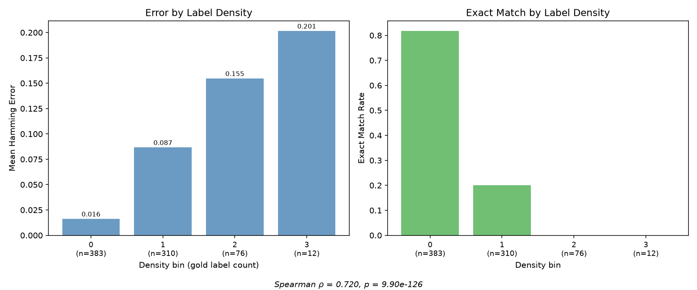


### Domain-controlled density effect

Testing whether the density→error relationship survives within individual domains:

| Domain | n | Mean Density | Mean Error | ρ | p |
|--------|--:|------------:|-----------:|--:|--:|
| CyberAggAdo | 781 | 0.64 | 0.0604 | 0.720 | 9.90e-126 *** |


### Length-stratified performance

**Spearman correlation** (word_count vs Hamming): ρ = 0.314, p = 2.37e-19 ***

Kruskal-Wallis: H=75.8165, p=3.44e-17, direction=increasing

| Length Bin | Range | n | Mean Error | Exact Match |
|-----------|-------|--:|-----------:|-----------:|
| short | [0, 4] | 264 | 0.0379 | 0.629 |
| medium | [5, 8] | 277 | 0.0554 | 0.498 |
| long | [9, 32] | 240 | 0.0910 | 0.296 |


### Cross-stratification (Density × Length)

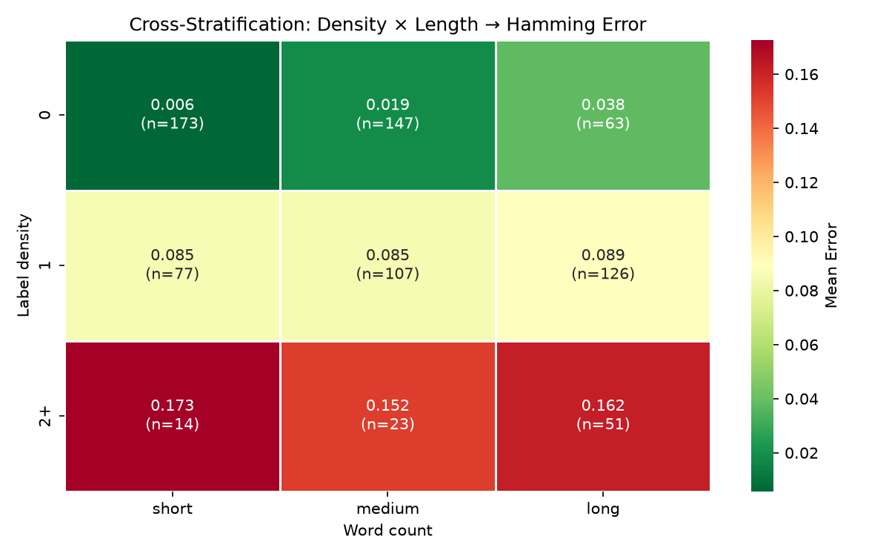

> [!CAUTION]
> **Danger zones** — combinations with highest error rates:
>
> - density=2+, length=short: mean_error=0.1726 (n=14)
> - density=2+, length=long: mean_error=0.1618 (n=51)
> - density=2+, length=medium: mean_error=0.1522 (n=23)


## 9. Feature Importance & Explainability


### Univariate Analysis

Features ranked by statistical significance (effect on Hamming error):

| Feature | Test | p-value | η² | Top Level | Mean Error |
|---------|------|--------:|---:|-----------|-----------:|
| HATE | Kruskal-Wallis | 9.85e-16 *** | 0.086 | OAG | 0.0781 |
| insulte | Mann-Whitney U | 1.39e-10 *** | 95.442 | 1 | 0.0871 |
| SENTIMENT | Kruskal-Wallis | 8.21e-10 *** | 0.051 | POS | 0.0741 |
| mépris / haine | Mann-Whitney U | 1.54e-09 *** | 74.153 | 1 | 0.0778 |
| INTENTION | Kruskal-Wallis | 1.15e-07 *** | 0.050 | DFN | 0.0716 |
| abréviation | Mann-Whitney U | 1.04e-05 *** | 27.062 | 1 | 0.0904 |
| argot | Mann-Whitney U | 2.21e-05 *** | 49.945 | 1 | 0.0801 |
| elongation | Mann-Whitney U | 2.48e-04 *** | 4.352 | 1 | 0.1275 |
| VERBAL_ABUSE | Kruskal-Wallis | 7.75e-03 ** | 0.017 | DNG | 0.0922 |
| interjection | Mann-Whitney U | 1.90e-02 * | 42.142 | 1 | 0.0762 |
| ROLE | Kruskal-Wallis | 1.02e-01 ns | 0.005 | bully | 0.0736 |
| TARGET | Kruskal-Wallis | 1.31e-01 ns | 0.006 | bully | 0.0813 |


### Random Forest Regressor

- OOB R²: 0.3708

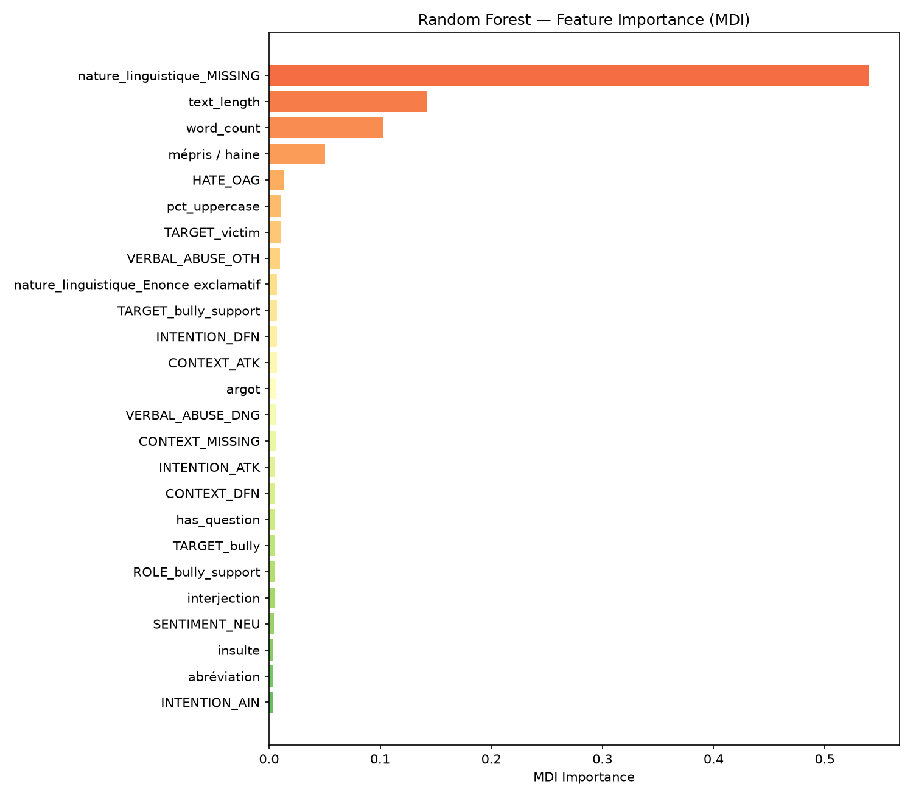

| Rank | Feature | MDI Importance |
|-----:|---------|---------------:|
| 1 | nature_linguistique_MISSING | 0.5401 |
| 2 | text_length | 0.1427 |
| 3 | word_count | 0.1031 |
| 4 | mépris / haine | 0.0502 |
| 5 | HATE_OAG | 0.0131 |
| 6 | pct_uppercase | 0.0112 |
| 7 | TARGET_victim | 0.0111 |
| 8 | VERBAL_ABUSE_OTH | 0.0101 |
| 9 | nature_linguistique_Enonce exclamatif | 0.0073 |
| 10 | TARGET_bully_support | 0.0073 |
| 11 | INTENTION_DFN | 0.0071 |
| 12 | CONTEXT_ATK | 0.0070 |
| 13 | argot | 0.0068 |
| 14 | VERBAL_ABUSE_DNG | 0.0064 |
| 15 | CONTEXT_MISSING | 0.0062 |


### SHAP Analysis

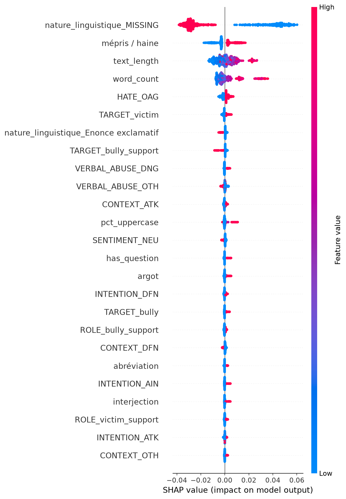

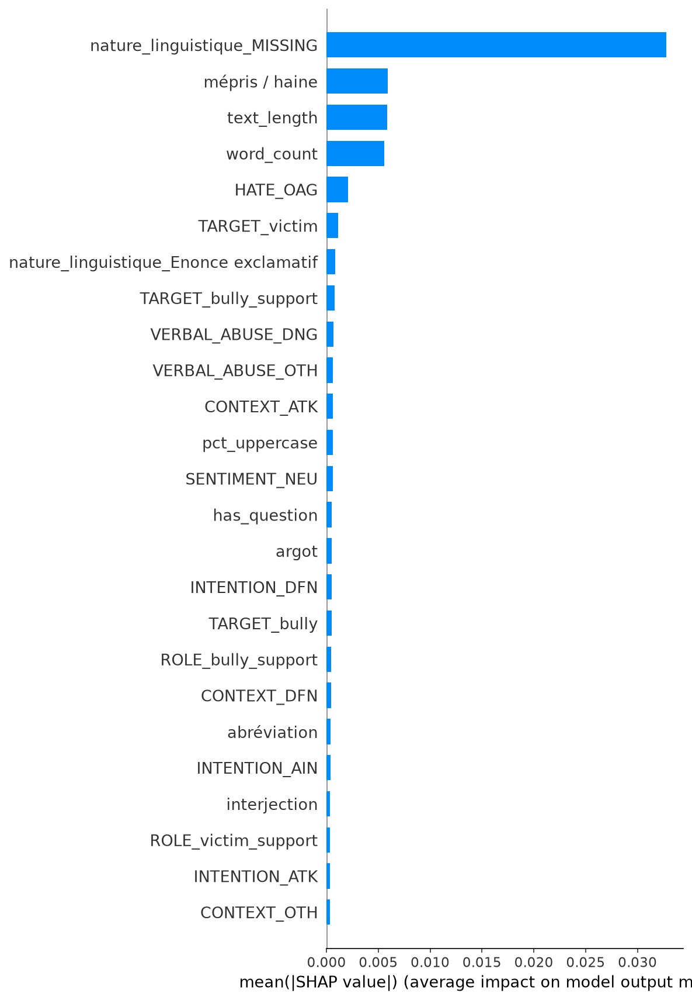

| Rank | Feature | mean \|SHAP\| |
|-----:|---------|-------------:|
| 1 | nature_linguistique_MISSING | 0.0328 |
| 2 | mépris / haine | 0.0059 |
| 3 | text_length | 0.0059 |
| 4 | word_count | 0.0056 |
| 5 | HATE_OAG | 0.0021 |
| 6 | TARGET_victim | 0.0011 |
| 7 | nature_linguistique_Enonce exclamatif | 0.0008 |
| 8 | TARGET_bully_support | 0.0008 |
| 9 | VERBAL_ABUSE_DNG | 0.0007 |
| 10 | VERBAL_ABUSE_OTH | 0.0006 |
| 11 | CONTEXT_ATK | 0.0006 |
| 12 | pct_uppercase | 0.0006 |
| 13 | SENTIMENT_NEU | 0.0006 |
| 14 | has_question | 0.0005 |
| 15 | argot | 0.0005 |


### Association Rules (High-Error Subset)

FP-Growth is run only on samples above the high-error threshold. The rules below describe co-occurring profiles inside failures; they are not causal effects or lift against the full corpus.

| Antecedent | Consequent | Support | Confidence | Lift |
|------------|------------|--------:|-----------:|-----:|
| HATE=NAG ∧ text_long | SENTIMENT=NEU | 0.084 | 0.706 | 6.73 |
| SENTIMENT=NEU | HATE=NAG ∧ text_long | 0.084 | 0.800 | 6.73 |
| SENTIMENT=NEU | HATE=NAG | 0.105 | 1.000 | 5.50 |
| SENTIMENT=NEU ∧ text_long | HATE=NAG | 0.084 | 1.000 | 5.50 |
| HATE=NAG | SENTIMENT=NEU | 0.105 | 0.577 | 5.50 |
| CONTEXT=ATK ∧ ROLE=victim | INTENTION=DFN ∧ text_long | 0.084 | 1.000 | 4.61 |
| INTENTION=DFN ∧ ROLE=victim_support ∧ VERBAL_ABUSE=OTH | TARGET=bully | 0.084 | 1.000 | 4.33 |
| INTENTION=DFN ∧ ROLE=victim_support ∧ SENTIMENT=NEG ∧ VERBAL_ABUSE=OTH | TARGET=bully | 0.084 | 1.000 | 4.33 |
| INTENTION=DFN ∧ ROLE=victim_support ∧ VERBAL_ABUSE=OTH | SENTIMENT=NEG ∧ TARGET=bully | 0.084 | 1.000 | 4.33 |
| TARGET=bully ∧ mépris / haine=1 | INTENTION=DFN ∧ ROLE=victim_support ∧ SENTIMENT=NEG | 0.091 | 0.684 | 4.25 |
| INTENTION=DFN ∧ ROLE=victim_support ∧ SENTIMENT=NEG | TARGET=bully ∧ mépris / haine=1 | 0.091 | 0.565 | 4.25 |
| ROLE=victim | CONTEXT=ATK ∧ INTENTION=DFN ∧ text_long | 0.084 | 0.750 | 4.13 |


### Decision Tree Rules (depth=4)

```
|--- nature_linguistique_MISSING <= 0.50
|   |--- mépris / haine <= 0.50
|   |   |--- TARGET_bully_support <= 0.50
|   |   |   |--- nature_linguistique_Autre <= 0.50
|   |   |   |   |--- value: [0.09]
|   |   |   |--- nature_linguistique_Autre >  0.50
|   |   |   |   |--- value: [0.12]
|   |   |--- TARGET_bully_support >  0.50
|   |   |   |--- value: [0.06]
|   |--- mépris / haine >  0.50
|   |   |--- text_length <= 89.50
|   |   |   |--- text_length <= 34.50
|   |   |   |   |--- value: [0.11]
|   |   |   |--- text_length >  34.50
|   |   |   |   |--- value: [0.14]
|   |   |--- text_length >  89.50
|   |   |   |--- value: [0.08]
|--- nature_linguistique_MISSING >  0.50
|   |--- word_count <= 12.50
|   |   |--- text_length <= 23.50
|   |   |   |--- word_count <= 4.50
|   |   |   |   |--- value: [0.01]
|   |   |   |--- word_count >  4.50
|   |   |   |   |--- value: [0.03]
|   |   |--- text_length >  23.50
|   |   |   |--- pct_uppercase <= 0.01
|   |   |   |   |--- value: [0.03]
|   |   |   |--- pct_uppercase >  0.01
|   |   |   |   |--- value: [0.07]
|   |--- word_count >  12.50
|   |   |--- HATE_OAG <= 0.50
|   |   |   |--- value: [0.08]
|   |   |--- HATE_OAG >  0.50
|   |   |   |--- value: [0.11]

```


### Bivariate Interactions

| Pair | Error Range | Max | Min |
|------|----------:|----|----:|
| HATE × elongation | 0.122 | 0.157 | 0.036 |
| elongation × abréviation | 0.119 | 0.176 | 0.057 |
| INTENTION × elongation | 0.112 | 0.139 | 0.026 |
| ROLE × elongation | 0.108 | 0.157 | 0.050 |
| ROLE × CONTEXT | 0.107 | 0.107 | 0.000 |
| VERBAL_ABUSE × CONTEXT | 0.100 | 0.133 | 0.033 |
| TARGET × elongation | 0.099 | 0.150 | 0.051 |
| elongation × mépris / haine | 0.096 | 0.142 | 0.046 |
| SENTIMENT × elongation | 0.095 | 0.128 | 0.033 |
| ROLE × SENTIMENT | 0.092 | 0.100 | 0.008 |


## 10. Synthesis & Recommendations


### Key Findings

1. **Dominant error label**: `Colère` has the highest FN rate (0.270), indicating the model frequently misses this emotion.

2. **Structural weakness**: 71/781 samples (9.1%) have an emotion predicted without any expression mode — the most prevalent annotation scheme violation.

3. **Density-error relationship**: Error increases with label density (ρ=0.720), confirming the hypothesis that denser vectors degrade performance.

4. **Threshold optimization**: Lowering mode thresholds for Comportementale→0.18, Désignée→0.05, Montrée→0.05, Suggérée→0.07 could reduce annotation scheme violations.

### Recommendations

1. **Post-processing cascade**: Implement logical rules after thresholding to enforce annotation scheme consistency (∀ emotion → Emo=1; ∀ emotion → at least one mode).

2. **Mode threshold calibration**: Use the Pareto-optimal thresholds from the sweep analysis to balance F1 and structural consistency.

3. **Context disabled for OOD**: Based on prior sanity checks, context should be disabled for OOD data (−9pp coherence degradation).

4. **Monitor density at inference time**: Inputs with high label density (many concurrent emotions) should be flagged for potential degraded performance.
